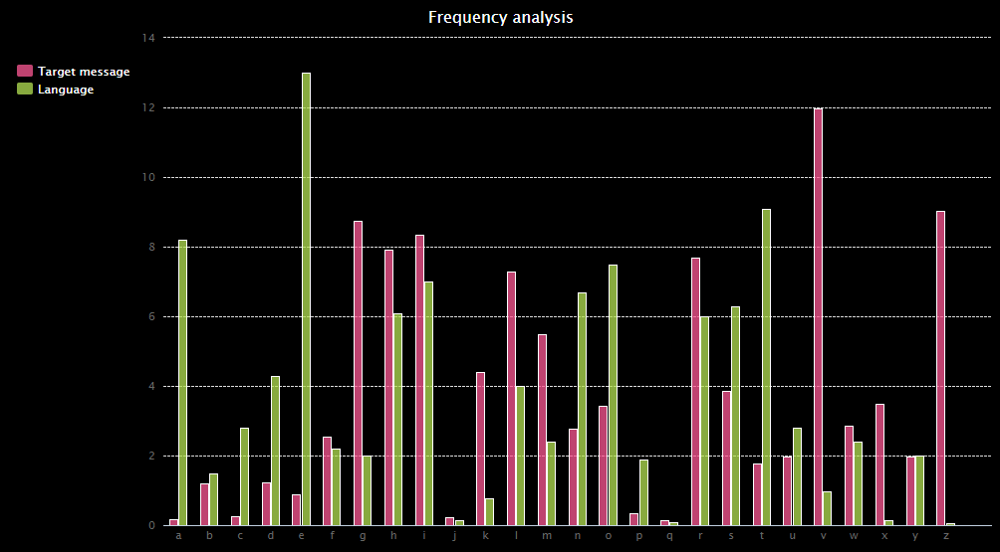

## Introduction

Analyse a graph to crack the code, whilst learning about lists and functions. 

{:width="400px"}

The Atbash cypher is one of the world's oldest known cyphers (a cypher is a secret or disguised way of writing). Originally developed in the Hebrew language, it takes the alphabet and matches it to it's reverse in order to create a secret message. The name derives from the first, last, second, and second-last Hebrew letters: Aleph, Taw, Bet  and Shin

You will:
+ Define a function that takes parameters and returns a value
+ Use a `while` and a `for` loop to repeat tasks 
+ Create a chart to display frequency data

--- no-print ---
--- task ---
### Try it

  
This program can **encode** or **decode** a secret message from an attached `.csv` file, or it can **analyse the frequency** of letters in the message. This data will be displayed in a frequency graph, which shows how often each letter appears in the secret message.

Run the program twice to explore how it works: 
+ First, choose 'c' to decode a message stored in an attached `.csv` file. 
+ Then, run the program a second time and choose 'f' at the prompt; this will display a letter frequency graph for the message.

<iframe src="https://trinket.io/embed/python/a867876e98?outputOnly=true&runOption=run" width="600" height="600" frameborder="0" marginwidth="0" marginheight="0" allowfullscreen></iframe>

--- /task ---
--- /no-print ---
