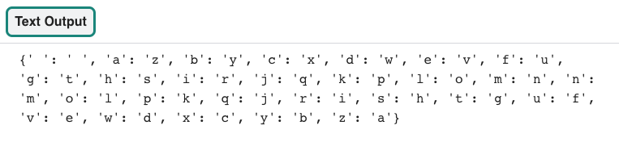

## Encode the alphabet

To start, you will **define** a function named `create_code` which will make a **list** with the letters of the alphabet and then create a **dictionary** you can use for your cypher.

{:width="300px"}

--- task ---

Open the [Codebreaker starter project](https://trinket.io/python/0eb6b467c0){:target="_blank"}. Trinket will open in another browser tab. 

If you have a `Trinket account`, you can click on the **Remix button** to save a copy to your My Trinkets library.

--- /task ---
### Set up the alphabet list and the code dictionary

The codebreaker program starts with two data structures. The first is a `list` of all the letters in the alphabet and the second is a `code` dictionary. To save typing time you can create a list from a string by using the `list()` function.  

<!--- I want an ingredient here that describes how the list function works. I don't know how to make one -->
--- task ---

Find the `# Set up data structures` comment then use the `list()` function to create a **list** of letters from the `alphabet`. Next, **initialise** the `code` dictionary so that you can populate it in a later step.  

--- code ---
---
language: python
filename: main.py
line_numbers: true
line_number_start: 5 
line_highlights: 7-8
---
# Set up data structures 

alphabet = list(' abcdefghijklmnopqrstuvwxyz ') # List from a string
code = {}

--- /code ---

--- /task ---

### Create a new list that reverses the alphabet

A new list needs to be created that holds the alphabet, but backwards. You can use the `list()` function again to help with this. You can also use the `reverse()` function to reverse an existing list. 

--- task ---

Find the `# Create the atbash code by reversing the alphabet` comment then **define** a new function called `create_code`. Next, create a **list** that holds the **reverse** of the `alphabet` list. 

--- code ---
---
language: python
filename: main.py
line_numbers: true
line_number_start: 10 
line_highlights: 12-14
---
# Create the atbash code by reversing the alphabet

def create_code():
  
  backwards = list(reversed(alphabet)) # Reversing a list

--- /code ---

--- /task ---

### Encode the alphabet

You now have two lists. One contains the alphabet written forwards, another with the alphabet backwards. You are now going to use these two lists to populate a dictionary. The **key** will store the alphabet written forwards and the **data pairing** will store the alphabet backwards. 

--- task ---

Within your `create_code` function, **populate** the `code` dictionary with data from the two **lists**. Use a `for` loop to get the length of the `alphabet` list and populate the **dictionary** with the data.

--- code ---
---
language: python
filename: main.py
line_numbers: true
line_number_start: 12
line_highlights: 16-17
---
def create_code():
  
  backwards = list(reversed(alphabet)) # Reversing a list
  
  for i in range(len(alphabet)): # Getting length of a list
    code[alphabet[i]] = backwards[i] # Populate the code dictionary with a letter of the alphabet and its encoded letter
--- /code ---

--- /task ---

A `main()` function is needed to **call** all of the required functions when your program first starts. 

--- task ---

Find the `# Start up` comment and **define** a `main()` function to call your `code()` function. Next, call the `main()` function in the main body of your code. 

--- code ---
---
language: python
filename: main.py
line_numbers: true
line_number_start: 39
line_highlights: 41-45
---
# Start up

def main():
  create_code()

  
main()
--- /code ---

--- /task ---

--- task ---

In order to test that your `code` dictionary has populated correctly, you can `print` the dictionary in full. Under your `for` loop in the `create_code` function, add a `print` function to display the contents. 

--- code ---
---
language: python
filename: main.py
line_numbers: true
line_number_start: 16
line_highlights: 19
---
  for i in range(len(alphabet)): # Getting length of a list
    code[alphabet[i]] = backwards[i] # Populate the code dictionary with a letter of the alphabet and its encoded letter
  
  print(code)
--- /code ---

--- /task ---
--- task ---

**Test:** Run your code to see if the `code` dictionary displays correctly. You should see a pattern starting with `a` paired with `z` and `b` being paired with `y`.  

**Debug:** There are no error messages but your code dictionary is not displaying on the screen.
- make sure that `print(code)` is indented correctly within the `create_code` function
- check that you have **called** the `create_code()` and the `main()` function correctly

**Debug:**

**Debug:**

**Debug:**

--- /task ---

--- save ---
