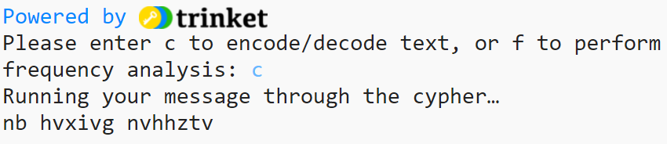

## Encode a message

The next step is to create a function which can take our text, flip it and reverse it with our atbash cypher list, and return it as an encoded message. 

{:width="400px"}

--- task ---
 
**Comment out** the print statement on line 19 by placing a hashtag at the beginning of the line:

--- code ---
---
language: python
filename: main.py
line_numbers: true
line_number_start: 16
line_highlights: 19
---
  for i in range(len(alphabet)): # Getting length of a list
    code[alphabet[i]] = backwards[i] # Populate the code dictionary with a letter of the alphabet and its encoded letter
  
#  print(code)
--- /code ---
 
--- /task ---

We will now add our new **function** that will reverse the **dictionary** we have created.

--- task ---

Find the comment which says `# Encode/decode a piece of text — atbash is symmetrical` on line 29. Underneath the comment, define a function called `atbash` with the **parameter** `text`.

--- code ---
---
language: python
filename: main.py
line_numbers: true
line_number_start: 29 
line_highlights: 31
---
# Encode/decode a piece of text — atbash is symmetrical

def atbash(text):

--- /code ---

Press Enter. You should see the next line indented. 

--- /task ---

We will need this new **function** to take our text, convert it to lower case, then add it all to another list. Then, we want it to swap out the letters in the list for the letters in our cypher - thus creating an encoded message! First, we need to **create the list** of our text.

--- task ---

 Beneath the line of code when you have defined the `atbash()` function, type: 

--- code ---
---
language: python
filename: main.py
line_numbers: true
line_number_start: 29 
line_highlights: 32-33
---
# Encode/decode a piece of text — atbash is symmetrical

def atbash(text):
  text = text.lower() # Converting text to lowercase
  output = ''

--- /code ---

--- /task ---

The next part of your code will **encode** the `text` that has been **passed** into the function. First it will convert the `text` to lowercase. A new **variable** called `output` will then need to be created to hold the encoded message. Next, a `for` loop will need to be used to go through each letter in the `text` and convert it to an encoded letter using the `code` dictionary. Finally, it will **return** the encoded message.   

--- task ---

Leave a blank line under the last code you entered (make sure you keep the indent), then type:

--- code ---
---
language: python
filename: main.py
line_numbers: true
line_number_start: 29 
line_highlights: 35-39
---
# Encode/decode a piece of text — atbash is symmetrical

def atbash(text):
  text = text.lower() # Converting text to lowercase
  output = ''
  
  for letter in text: 
    if letter in code: 
      output += code[letter] # Populate output with the encoded/decoded message using the dictionary
  
  return output # Return the encoded/decoded message

--- /code ---

--- /task ---

Now that we have a **function** which will **encode text** we give it and output a new encoded message, we need to run it to make sure it works. To do that, we will create a menu by coding a **loop** that will repeatedly ask our user which function they would like to use. As we only have one function at the moment, it's pretty simple. 

--- task ---

**Find** the comment in your code that says `# Create a text-based menu system` on line 45 and begin by defining a function called `menu()`:

--- code ---
---
language: python
filename: main.py
line_numbers: true
line_number_start: 45
line_highlights: 47
---
# Create a text-based menu system

def menu():
--- /code ---

--- /task ---

Now we are going to set the `choice` when the program first runs to `None`. Because the **loop** we are about to write requires a 'correct' answer (one we have defined) to break the loop, storing an initial wrong answer will keep the menu loop running until another 'correct' answer is entered. 

--- task ---

**Find** the comment in your code that says `# Start with a wrong answer for choice`. Underneath this line (making sure you have an indent!) type:

--- code ---
---
language: python
filename: main.py
line_numbers: true
line_number_start: 45
line_highlights: 49-50
---
# Create a text-based menu system  

def menu():
  
  # Start with a wrong answer for choice. Introduce None?
  choice = None

--- /code ---

--- /task ---

Now that we have set choice to a wrong answer, we want to create a **loop** that will only break if an `input` that matches a right answer is given. We want a while loop, that runs as long as our answer **DOES NOT** match one we have defined. 

--- task ---

**Find** the comment in your script that says `# Keep asking the user for the right answer`. Underneath this line (making sure you have an indent!) type:

--- code ---
---
language: python
filename: main.py
line_numbers: true
line_number_start: 47
line_highlights: 52-55
---
def menu():
  
  # Start with a wrong answer for choice. Introduce None?
  choice = None
  
  # Keep asking the user for the right answer
  while choice != 'c' and choice != 'f':
    
    choice = input('Please enter c to encode/decode text, or f to perform frequency analysis:' )
--- /code ---

--- /task ---

We want to run our `atbash` function when the answer is correct. We've just defined that a wrong answer is **anything except `c`** - so our next bit of code will define what happens if the answer given **is `c`**. If the user chooses `c`, the code should then take a message (this needs to be a **string**), and pass it into our `atbash` function as the text to be encoded.

Passing information into a function allows us to store information in variables and use these values when the function is called. The parameters  of a function (listed in the brackets in the function's definition) mean we can pass a value into it through one of the parameters. This value is then used by the function in it's operation. 

--- task ---

Underneath the last line (making sure you still have an indent!) type:

--- code ---
---
language: python
filename: main.py
line_numbers: true
line_number_start: 47
line_highlights: 57-61
---
def menu():
  
  # Start with a wrong answer for choice. Introduce None?
  choice = None
  
  # Keep asking the user for the right answer
  while choice != 'c' and choice != 'f':
    
    choice = input('Please enter c to encode/decode text, or f to perform frequency analysis:' )
  
  if choice == 'c':
    print('Running your message through the cypher…')
    message = 'my secret message' 
    code = atbash(message)
    print(code)

--- /code ---

--- /task ---

--- task ---

At the end of your `main()` function on line 66 type:

--- code ---
---
language: python
filename: main.py
line_numbers: true
line_number_start: 64
line_highlights: 68
---

# Start up

def main():
  create_code()
  menu()

--- /code ---

To call the `menu` function when the program runs.

--- /task ---

--- task ---

**Save and run** your script. 

You should see your input prompt appear in the shell - press `c` and then `Enter` to encode your message string!

--- /task ---

--- save ---