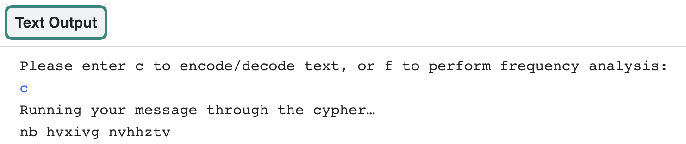

## Encode a message

In this step you will create a function which can take your text, flip it and reverse it with your atbash cypher list, and return it as an encoded message. 

{:width="400px"}

--- task ---
 
**Comment out** the print statement used for testing on line 19 by placing a hashtag at the beginning of the line:

--- code ---
---
language: python
filename: main.py
line_numbers: true
line_number_start: 16
line_highlights: 19
---
  for i in range(len(alphabet)): # Getting length of a list
    code[alphabet[i]] = backwards[i] # Populate the code dictionary with a letter of the alphabet and its encoded letter
  
#  print(code)
--- /code ---
 
--- /task ---

You will now add your new **function** that will encode some text using the **atbash** cypher.

--- task ---

Find the comment which says `# Encode/decode a piece of text — atbash is symmetrical` on line 29. Underneath the comment; define a function called `atbash`, with the **parameter** `text`. Parameters allow you to pass values into functions that can be used within that function.

--- code ---
---
language: python
filename: main.py
line_numbers: true
line_number_start: 29 
line_highlights: 31
---
# Encode/decode a piece of text — atbash is symmetrical

def atbash(text):

--- /code ---

Press Enter. You should see the next line indented. 

--- /task ---

[[[parameters]]]

First your function needs to convert the `text` to lowercase. A new **variable** called `output` will then need to be created to hold the encoded message.

--- task ---

 Beneath the line of code when you have defined the `atbash()` function, type: 

--- code ---
---
language: python
filename: main.py
line_numbers: true
line_number_start: 29 
line_highlights: 32-33
---
# Encode/decode a piece of text — atbash is symmetrical

def atbash(text):
  text = text.lower() # Converting text to lowercase
  output = ''

--- /code ---

--- /task ---

The next part of your code will **encode** the `text` that has been **passed** into the function. A `for` loop will need to be used to go through each letter in the `text` and convert it to an encoded letter using the `code` dictionary. Finally, it will **return** the encoded message.   

--- task ---

Leave a blank line under the last code you entered (make sure you keep the indent), then type:

--- code ---
---
language: python
filename: main.py
line_numbers: true
line_number_start: 29 
line_highlights: 35-39
---
# Encode/decode a piece of text — atbash is symmetrical

def atbash(text):
  text = text.lower() # Converting text to lowercase
  output = ''
  
  for letter in text: 
    if letter in code: 
      output += code[letter] # Populate output with the encoded/decoded message using the dictionary
  
  return output # Return the encoded/decoded message

--- /code ---

--- /task ---

--- task ---

Now that you have a **function** which will **encode text**, you need to run it to make sure it works. Create a function call to run the `atbash` function and pass some text into it as the parameter. 

--- code ---
---
language: python
filename: main.py
line_numbers: true
line_number_start: 1
line_highlights: 
---
print(atbash('Test'))

--- /code ---

--- /task ---

--- task ---

**Find** the comment in your code that says `# Create a text-based menu system` on line 45 and begin by defining a function called `menu()`:

--- code ---
---
language: python
filename: main.py
line_numbers: true
line_number_start: 45
line_highlights: 47
---
# Create a text-based menu system

def menu():
--- /code ---

--- /task ---

Your menu needs a **loop** that continually asks the user what they would like to do until they have entered a valid choice. To get this started, you will create a **variable** called `choice` and set it to `None`. This will allow the **while** loop to run its first loop. 

--- task ---

Create a new variable called `choice` and set the value to `None`:

--- code ---
---
language: python
filename: main.py
line_numbers: true
line_number_start: 45
line_highlights: 49-50
---
# Create a text-based menu system  

def menu():
  
  # Start with a wrong answer for choice. 
  choice = ''

--- /code ---

--- /task ---

Now that you have set `choice` to a wrong answer, you want to create a **loop** that will only break if an `input` that matches a right answer is given. You want a **while loop**, that runs as long as your answer **DOES NOT** match one you have defined. 

--- task ---

You can use a **while loop** to run a piece of code **while** a **condition** is **True**. In this instance, as long as the user **does not** choose `c` or `f`, the loop will continue to run. Enter the code that will set the **conditions** for a **while loop** and prompt the user for input:

--- code ---
---
language: python
filename: main.py
line_numbers: true
line_number_start: 47
line_highlights: 52-55
---
def menu():
  
  # Start with a wrong answer for choice. 
  choice = None
  
  # Keep asking the user for the right answer
  while choice != 'c' and choice != 'f':
    
    choice = input('Please enter c to encode/decode text, or f to perform frequency analysis:' )
--- /code ---

--- /task ---

Once the user has given a correct answer, the loop will end. Next create an if statement that will run your `atbash` function if the user picks `c`.

You will decide what happens when a user enters `f` in a later step. 

--- task ---

Underneath the last line (making sure you still have an indent!) type:

--- code ---
---
language: python
filename: main.py
line_numbers: true
line_number_start: 47
line_highlights: 57-61
---
def menu():
  
  # Start with a wrong answer for choice. 
  choice = None
  
  # Keep asking the user for the right answer
  while choice != 'c' and choice != 'f':
    
    choice = input('Please enter c to encode/decode text, or f to perform frequency analysis:' )
  
  if choice == 'c':
    print('Running your message through the cypher…')
    message = 'my secret message' 
    code = atbash(message)
    print(code)

--- /code ---

--- /task ---

--- task ---

On line 59, change the string that says `'my secret message'` to anything you like. This string is the message that will be encoded and decoded :

--- code ---
---
language: python
filename: main.py
line_numbers: true
line_number_start: 47
line_highlights: 59
---
def menu():
  
  # Start with a wrong answer for choice. 
  choice = None
  
  # Keep asking the user for the right answer
  while choice != 'c' and choice != 'f':
    
    choice = input('Please enter c to encode/decode text, or f to perform frequency analysis:' )
  
  if choice == 'c':
    print('Running your message through the cypher…')
    message = 'my secret message' 
    code = atbash(message)
    print(code)

--- /code ---

--- /task ---

--- task ---

At the end of your `main()` function on line 66 type:

--- code ---
---
language: python
filename: main.py
line_numbers: true
line_number_start: 64
line_highlights: 68
---

# Start up

def main():
  create_code()
  menu()

--- /code ---

To call the `menu` function when the program runs.

--- /task ---

--- task ---

**Save and run** your script. 

You should see your input prompt appear in the shell - press `c` and then `Enter` to encode your message string!

--- /task ---

In the next step you will use your `atbash()` to encode the contents of a text file. 

--- save ---