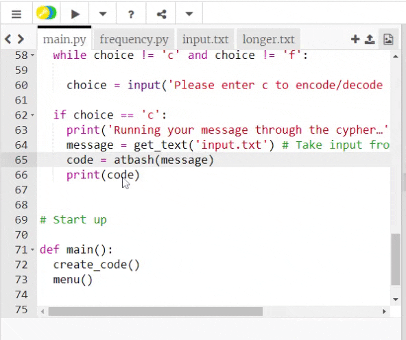
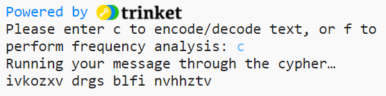

## Encode contents from a text file

Its time to encode a message from a text file. 

{:width="400px"}

--- task ---

Find the `# Fetch and return text from a file` comment on line 70 then define a `get_text()` function. This function has one parameter called `filename`. Use the `filename` to open the file and read it into the `text` variable, then **return** the `text` variable.

--- code ---
---
language: python
filename: main.py
line_numbers: true
line_number_start: 70
line_highlights: 72-76
---
# Fetch and return text from a file

def get_text(filename):
    with open(filename, 'r') as f:
      text = f.read().replace('\n','') # Need to strip the newline characters
    
    return text
--- /code ---

--- /task ---

--- task ---

The `menu()` function needs to encode a secret message from a text file. Find line 64 and **replace** `message = 'my secret message'` with the `get_text()` function call. Enter the name of the file `input.txt` as an **argument**.

--- code ---
---
language: python
filename: main.py
line_numbers: true
line_number_start: 62
line_highlights: 64
---
  if choice == 'c':
    print('Running your message through the cypher…')
    message = get_text('input.txt') # Take input from a file 
    code = atbash(message)
    print(code)
--- /code ---

--- /task ---

You can now **add** your own secret message to the `input.txt` file. 

--- task ---

Find the `input.txt` tab in Trinket to access the contents of the text file. You will see this just above your code window. Delete the `replace with your message` text and enter your own secret message. 

<!-- Does this need any instructions for offline use?-->

--- /task ---

--- task ---

**Test:** Run your code to see if it displays your encoded message after entering the letter **c** when prompted. 

**Debug:** Your encoded message doesn't look exactly like the message in the screenshot:
- This is normal. This is the encoded message for the text `replace with your message`. Your message will be different.

**Debug:** You see an error message that says `TypeError: get_text() takes exactly 1 arguments`:
- Check that you have entered `input.txt` inside the round brackets on line 64

**Debug:** You se an `Indentation error` message:
- Check that you have correctly indented all of your new code. Revisit the tasks above to check. 

--- /task ---

--- save ---