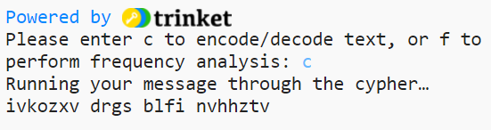

## Encode contents from a text file

Its time to encode a message from a text file. 

{:width="400px"}

--- task ---

Find the `# Fetch and return text from a file` comment on line 70 then define a `get_text()` function. This function has one parameter called `filename`. Use the `filename` to open the file and read it into the `text` variable then **return** the `text` variable.

--- code ---
---
language: python
filename: main.py
line_numbers: true
line_number_start: 70
line_highlights: 72-76
---
# Fetch and return text from a file

def get_text(filename):
    with open(filename, 'r') as f:
      text = f.read().replace('\n','') # Need to strip the newline characters
    
    return text
--- /code ---

--- /task ---

--- save ---