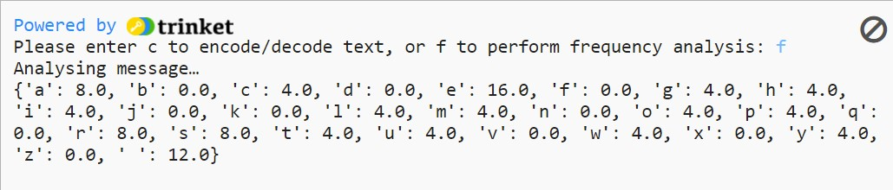

## Create a Frequency Analyser

In this step, you will code a frequency analyser function to work out how often each letter of the alphabet appears in your text. 

Frequency Analysis measures how often something appears so you can look for patterns in that data. It is possible to decode monoalphabetic cyphers (if you know the language the message is in) by looking at how often each letter appears and matching it to the [most commonly used letters](http://letterfrequency.org/letter-frequency-by-language/) in that language.

 You now need to create a function that will take your text and convert it all to one case (to avoid confusion), count the number of times each letter in the message appears, then convert that number into a percentage of the whole so you can compare it to the frequency of letters in English.

--- task ---

On line 23, beneath the comment that reads `# Calculate the frequency of all letters in a piece of text`, define a function called `frequency`, and have the first thing it does be to convert your message to lower case:

--- code ---
---
language: python
filename: main.py
line_numbers: true
line_number_start: 21 
line_highlights: 23-25
---
# Calculate the frequency of all letters in a piece of text

def frequency(text):
    
    text = list(text.lower()) # Lowercase the message and make it a list
--- /code ---

--- /task ---

--- task ---

On line 28 beneath, we will create a dictionary called `freq` and for every `letter` in the list `alphabet` it assigns a value of 0. Make sure you **keep the indentation** and type:

--- code ---
---
language: python
filename: main.py
line_numbers: true
line_number_start: 21
line_highlights: 27-30
---
# Calculate the frequency of all letters in a piece of text

def frequency(text):
  
  text = list(text.lower()) # Lowercase the message and make it a list
  
  # Create a dict of every letter, with a count of 0
  freq = {}
  for letter in alphabet:
    freq[letter] = 0
--- /code ---

--- /task ---

--- task ---

The next thing you need your function to do is to count the letters in the message, create a variable called `total_letters` and assign the length of the text to that variable. 

On line 31, make sure you **keep the indentation** and type:

--- code ---
---
language: python
filename: main.py
line_numbers: true
line_number_start: 21
line_highlights: 32-33
---
# Calculate the frequency of all letters in a piece of text

def frequency(text):
  
  text = list(text.lower()) # Lowercase the message and make it a list
  
  # Create a dict of every letter, with a count of 0
  freq = {}
  for letter in alphabet:
    freq[letter] = 0

  # Count the letters in the message
  total_letters = len(text)
--- /code ---

--- /task ---

Once you know how long the message is, you can begin counting the letters in it to determine how often they appear.

--- task ---

Create a for loop to count every time each letter appears in the text. Leave a blank line at the end of your script, make sure you keep the indentation and add:

--- code ---
---
language: python
filename: main.py
line_numbers: true
line_number_start: 21
line_highlights: 35-37
---
# Calculate the frequency of all letters in a piece of text

def frequency(text):
  
  text = list(text.lower()) # Lowercase the message and make it a list
  
  # Create a dict of every letter, with a count of 0
  freq = {}
  for letter in alphabet:
    freq[letter] = 0
  
  # Count the letters in the message
  total_letters = len(text)
  
  for letter in text:
    if letter in freq: # Maybe it's punctuation? First use of in as a conditional clause
      freq[letter] += 1
--- /code ---

--- /task ---

--- collapse ---
---
title: Counting the letters 
---

--- code ---
---
language: python
filename: main.py
line_numbers: false
line_number_start: 
line_highlights:
---
for letter in text:
    if letter in freq:
        freq[letter] += 1

--- /code ---

This section of code looks at each of the letters in your message `text`, and if the letter appears in your frequency list it adds 1 to that letter's value. The more times a letter appears, the higher that value will be. Once you know how often each letter appears, you can then convert from this count to a percentage of the whole message (since you know the length).

--- /collapse ---

--- task ---

Create a loop which converts the number of times the letters appear into a percentage of the whole message. On line 39, make sure to keep the indentation and type:
 
--- code ---
---
language: python
filename: main.py
line_numbers: true
line_number_start: 21
line_highlights: 39-41
---
# Calculate the frequency of all letters in a piece of text

def frequency(text):
  
  text = list(text.lower()) # Lowercase the message and make it a list
  
  # Create a dict of every letter, with a count of 0
  freq = {}
  for letter in alphabet:
    freq[letter] = 0
  
  # Count the letters in the message
  total_letters = len(text)
  
  for letter in text:
    if letter in freq: 
      freq[letter] += 1
  
  # Convert from counts to percentages
  for letter in freq:
    freq[letter] = freq[letter] / total_letters * 100
 
--- /code ---

--- /task ---

--- task ---

**Return** the frequency dictionary so it can be used elsewhere in your code. Leave a blank line and type:

--- code ---
---
language: python
filename: main.py
line_numbers: true
line_number_start: 21
line_highlights: 43
---
# Calculate the frequency of all letters in a piece of text

def frequency(text):
  
  text = list(text.lower()) # Lowercase the message and make it a list
  
  # Create a dict of every letter, with a count of 0
  freq = {}
  for letter in alphabet:
    freq[letter] = 0
  
  # Count the letters in the message
  total_letters = len(text)
  
  for letter in text:
    if letter in freq: 
      freq[letter] += 1
  
  # Convert from counts to percentages
  for letter in freq:
    freq[letter] = freq[letter] / total_letters * 100

  return freq
 
--- /code ---

--- /task ---

Now you have a function which can calculate the frequency of letters in your message, you need to link it to your user menu. Right now, out user can only choose the letter `c` to encode or decode a message. We're now going to add the option `f` to analyse the letter frequency of your message by calling your new function. 

--- task ---

Scroll down to your `menu` function at the bottom of your script. On line 78 and 80 change your code to match the following:

--- code ---
---
language: python
filename: main.py
line_numbers: true
line_number_start: 77 
line_highlights: 78-80
---
  # Keep asking the user for the right answer
  while choice != 'c' and choice != 'f':
    
    choice = input('Please enter c to encode/decode text, or f to perform frequency analysis:' )
--- /code ---

--- /task ---

Underneath your first `if` statement asking the user to select `c`, you need to add en `elif` statement so the user can choose the option to analyse and print the letter frequency by pressing `f`.

--- task ---

Leave a blank line after the `if` statement and on line 88 type:

--- code ---
---
language: python
filename: main.py
line_numbers: true
line_number_start: 77
line_highlights: 88-92
---
  # Keep asking the user for the right answer
  while choice != 'c' and choice != 'f':
    
    choice = input('Please enter c to encode/decode text, or f to perform frequency analysis:' )
  
  if choice == 'c':
    print('Running your message through the cypher…')
    message = get_text('input.txt') # Take input from a file 
    code = atbash(message)
    print(code)

  elif choice == 'f':
    print('Analysing message…')
    message = get_text('input.txt') # Take input from the same file. you have a 'longer.txt' or similar containing cyphertext you know to perform reasonably well for frequency analysis
    message_freq = frequency(message) # Get the frequency of the letters in the message, as %
    print(message_freq)
--- /code ---

Save and run your code. Choose `f` at the prompt and you should see a readout of the letter frequency of your message in the console.

--- /task ---

In the next step you will display the frequency analysis data in a cool looking chart!

--- save ---
