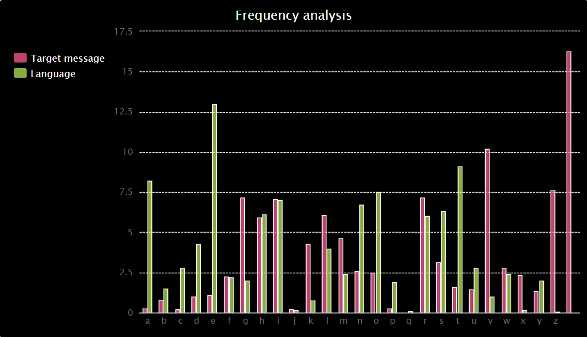

## Analyse the frequency

Use a bar chart to analyse the frequency of letters in an encoded message. 

{:width="400px"}

In all languages, each letter in its alphabet has a 'personality' or set of traits when used in that language. One of the most obvious traits a letter has in any language is how often it appears.  **Frequency analysis** is the method of breaking codes by looking at how often letters are used in the language of the code, and comparing that to how often encoded letters show up in a message. In English, the letter **E** is the most commonly used letter (it shows up 12.8% of the time), followed by **T** (at 9.1%). The least often used letter is **Z**.

--- task ---

The `print(message_freq)` line of code on line 78 is no longer needed. Add a `#` to the beginning of it so that Python ignores it when the code is run. 

--- code ---
---
language: python
filename: main.py
line_numbers: true
line_number_start: 74
line_highlights: 78
---
  elif choice == 'f':
    print('Analysing message…')
    message = get_text('input.txt') # Take input from the same file. We have a 'longer.txt' or similar containing cyphertext we know to perform reasonably well for frequency analysis
    message_freq = frequency(message) # Get the frequency of the letters in the message, as %
    #print(message_freq)
--- /code ---

--- /task ---

### Make the frequency chart function

--- task ---

Find the `# Make frequency chart` comment on line 37 and create a new function called `make_chart()`. This function needs two parameters called `text` and `language`. The frequency chart will be a **bar** chart and the **title** is `Frequency analysis`.

--- code ---
---
language: python
filename: main.py
line_numbers: true
line_number_start: 37
line_highlights: 38-40
---
# Make frequency chart
def make_chart(text, language):
  chart = Bar()
  chart.title = 'Frequency analysis'
--- /code ---

--- /task ---

--- task ---

Create **x-axis** labels using the **keys** from the `freq` dictionary. The `freq` dictionary values will be passed into the function when it is called later in the code, via the `text` parameter. 

--- code ---
---
language: python
filename: main.py
line_numbers: true
line_number_start: 37
line_highlights: 41
---
# Make frequency chart
def make_chart(text, language):
  chart = Bar()
  chart.title = 'Frequency analysis'
  chart.x_labels = text.keys() # Label the chart with the dictionary keys (A-Z)
--- /code ---

--- /task ---

--- task ---

Label the chart with the **frequency** of letters in the encoded message and the known letter frequency of the **language** the message is in. This data has been **passed into** the **function** via the `text` and `language` parameters. 

--- code ---
---
language: python
filename: main.py
line_numbers: true
line_number_start: 37
line_highlights: 42-43
---
# Make frequency chart
def make_chart(text, language):
  chart = Bar()
  chart.title = 'Frequency analysis'
  chart.x_labels = text.keys() # Label the chart with the dictionary keys (A-Z)
  chart.add('Target message', text.values()) # Label the frequency data for the encoded message
  chart.add('Language', language.values()) # Label the frequency data for the language
--- /code ---

--- /task ---

--- task ---

**Render** the chart so that it will display when the function is called. 

--- code ---
---
language: python
filename: main.py
line_numbers: true
line_number_start: 37
line_highlights: 45
---
# Make frequency chart
def make_chart(text, language):
  chart = Bar()
  chart.title = 'Frequency analysis'
  chart.x_labels = text.keys() # Label the chart with the dictionary keys (A-Z)
  chart.add('Target message', text.values()) # Label the frequency data for the encoded message
  chart.add('Language', language.values()) # Label the frequency data for the language
  
  chart.render()
--- /code ---

--- /task ---

### Call the frequency chart function

--- task ---

Find your `elif` in the `menu()` function on line 80. Add a line of code that will **import** the `english` frequency dictionary from the `frequency.py` file. Add another line of code that will **call** the `make_chart` function to draw the chart. 

--- code ---
---
language: python
filename: main.py
line_numbers: true
line_number_start: 80
line_highlights: 85-86
---
  elif choice == 'f':
    print('Analysing message…')
    message = get_text('input.txt') # Take input from the same file. We have a 'longer.txt' or similar containing cyphertext we know to perform reasonably well for frequency analysis
    message_freq = frequency(message) # Get the frequency of the letters in the message, as %
    # print(message_freq)
    lang_freq = english # Import the English frequency dictionary
    make_chart(message_freq, lang_freq) # Call the function to make a chart
--- /code ---

--- /task ---

--- task ---

**Test:** Run your code to display the frequency analysis bar chart. 

**Debug:** Your chart doesn't look exactly the same as the one displayed in the image above:
- This is normal. Your chart will display the frequency data for the secret message that you have entered in `input.txt`

**Debug:** You see the following error message `NameError: name 'lang_freq' is not defined`:
- Check that you added the line of code `lang_freq = english # Import the English frequency dictionary` **before** the `make_chart()` function call.

**Debug:** You see an `Indentation error` message:
- Check that you have correctly indented all of your new code. Revisit the tasks above to check.

--- /task ---

### Analyse the frequency chart

The chart that has been produced shows the frequency of letters in the English language, labelled as **Language**. You can see that the letter **E** is the most frequently used letter in the English language because it has the highest bar for all of the **language** values. 

The frequency chart also lists the frequency of letters in your **encoded** message, labelled as **Target message**. To work out what **encoding** has been used for this message you can compare the bars showing the English language with the bars on the encoded message. The highest bar in the encoded message text will most likely be an **E**. The second highest letter will most likely be a **T** as this is the next most popular letter. 

Codebreakers can use the frequency of letters to work out the type of encoding that has been used on the message. They can use trial and error to **predict** what a letter might be representing using the chart as a guide. 

--- task ---

Your secret message is quite small making it tricky to analyse using a frequency chart. Change your code so that it analyses the message in `longer.txt` instead. 

Go to line 82 and change `input.txt` to `longer.txt`.

--- code ---
---
language: python
filename: main.py
line_numbers: true
line_number_start: 80
line_highlights: 82
---
  elif choice == 'f':
    print('Analysing message…')
    message = get_text('longer.txt') 
    message_freq = frequency(message) # Get the frequency of the letters in the message, as %
--- /code ---

--- /task ---

--- task ---

**Analyse** the frequency chart by looking at the **Language** values and the **Target message** values. Notice how the highest bar for **Language** is **E** and the highest bar for **Target message** is **V**. This is because with the **Atbash** cypher, the letter **E** is encoded with the letter **V**. 

--- /task ---

--- save ---