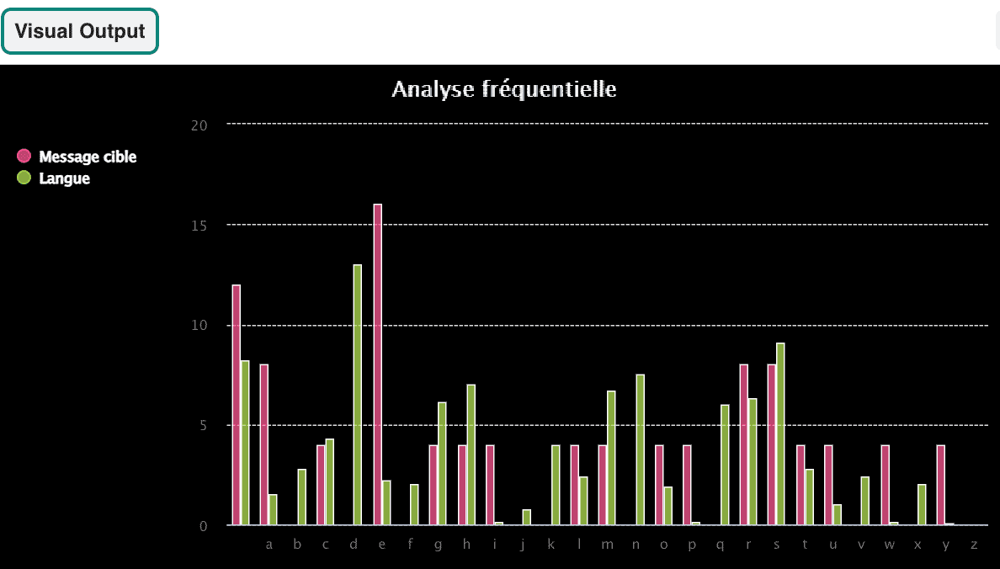

  <a class="c-survey-banner__link" href="https://form.raspberrypi.org/f/code-editor-feedback" target="_blank">Participe à notre enquête</a> pour nous aider à améliorer notre Code Editor !

## Ce que tu vas faire

Analyse un graphique pour déchiffrer le code, tout en apprenant ce que sont les listes et les fonctions.

Tu vas :
+ Définir une fonction qui prend des paramètres et renvoie une valeur
+ Utiliser les boucles `while` et `for` pour répéter les tâches
+ Créer un graphique pour afficher les données de fréquence

--- no-print ---

### Joue ▶️

--- task ---

  

Ce programme peut **coder** ou **décoder** un message secret à partir d'un fichier `.txt` joint, ou il peut **analyser la fréquence** des lettres dans un message. Ces données seront affichées dans un graphique de fréquence, qui indique la fréquence d'apparition de chaque lettre dans le message secret.

Exécute le programme deux fois pour découvrir comment il fonctionne : 
+ Choisis d'abord 'c' pour décoder un message stocké dans un fichier `.txt` joint 
+ Ensuite, exécute le programme une deuxième fois et choisis 'f' à l'invite ; ceci affichera un graphique de fréquence de lettres pour le message.

<iframe src="https://editor.raspberrypi.org/en/embed/viewer/codebreaker-project-example" width="600" height="600" frameborder="0" marginwidth="0" marginheight="0" allowfullscreen>
</iframe>

--- /task ---

--- /no-print ---

Le cryptogramme Atbash est l'un des plus anciens cryptogrammes connus au monde (un cryptogramme est une méthode d'écriture secrète ou déguisée). Développé à l'origine dans la langue hébraïque, il prend l'alphabet et le fait correspondre à son ordre inverse pour créer un message secret. Le nom dérive de la première, de la dernière, de la deuxième et de l'avant-dernière lettre hébraïque : Aleph, Taw, Bet, et Shin.

--- print-only ---  --- /print-only ---