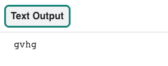

## Coder un message

Dans cette étape, tu vas créer une fonction qui peut prendre ton texte, le retourner et l'inverser avec ta liste de cryptage atbash, et le renvoyer sous forme de message codé. 

{:width="300px"}

--- task ---

**Commente** l'instruction print utilisée pour le test à la ligne 17 en plaçant un hashtag au début de la ligne :

--- code ---
---
language: python
filename: main.py - create_code()
line_numbers: true
line_number_start: 14
line_highlights: 17
---
    for i in range(len(alphabet)):  # Obtenir la longueur d'une liste
        code[alphabet[i]] = inverses[i]  # Remplir le dictionnaire de codes avec une lettre de l'alphabet et sa lettre codée

# print(code)
--- /code ---

--- /task ---

### Configurer ta fonction atbash

Tu vas maintenant ajouter ta nouvelle **fonction** qui va coder un peu de texte à l'aide du cryptage **atbash**.

--- task ---

Trouve le commentaire qui dit `# Coder/décoder un morceau de texte - atbash est symétrique`. Sous le commentaire, définis une fonction appelée `atbash`, avec le **paramètre** `texte`. Les paramètres te permettent de passer des valeurs dans les fonctions qui peuvent être utilisées à l'intérieur de cette fonction.

--- code ---
---
language: python
filename: main.py - atbash()
line_numbers: true
line_number_start: 26
line_highlights: 27
---
# Coder/décoder un morceau de texte - atbash est symétrique
def atbash(texte):

--- /code ---

Appuie sur <kbd>Entrée</kbd>. Tu devrais voir la ligne suivante indentée.

--- /task ---

[[[parameters]]]

### Convertir le texte en minuscules

Tout d'abord, ta fonction doit convertir le `texte` en minuscules. Une nouvelle **variable** appelée `sortie` doit alors être créée pour contenir le message codé.

--- task ---

Sous la ligne de code où tu as défini la fonction `atbash()`, tape :

--- code ---
---
language: python
filename: main.py - atbash()
line_numbers: true
line_number_start: 26
line_highlights: 28-29
---
# Coder/décoder un morceau de texte - atbash est symétrique
def atbash(texte):
    texte = texte.lower()  # Convertit le texte en minuscules
    sortie = ''

--- /code ---

--- /task ---

### Code ton texte

La partie suivante de ton code va **coder** le `texte` qui a été **passé** dans la fonction. Une boucle `for` est utilisée pour parcourir chaque lettre du `texte` et la convertir en lettre codée à l'aide du dictionnaire `code`. Enfin, il **retournera** le message codé.

--- task ---

Laisse une ligne vide sous le dernier code que tu as saisi (assure-toi de garder l'indentation), puis tape :

--- code ---
---
language: python
filename: main.py - atbash()
line_numbers: true
line_number_start: 26
line_highlights: 31-35
---
# Coder/décoder un morceau de texte - atbash est symétrique
def atbash(texte):
    texte = texte.lower()  # Convertit le texte en minuscules
    sortie = ''

    for lettre in texte: 
        if lettre in code: 
            output += code[lettre]  # Remplit la sortie avec le message codé/décodé en utilisant le dictionnaire
    
    return sortie  # Renvoyer le message codé/décodé

--- /code ---

--- /task ---

### Test et débogage

--- task ---

Maintenant que tu as une **fonction** qui va **coder du texte**, tu dois l'exécuter pour t'assurer qu'elle fonctionne. Trouve ta fonction `main()` et ajoute un appel de fonction pour exécuter la fonction `atbash()`.

La chaîne 'Test' est **passée** dans la fonction afin qu'elle puisse être codée.

--- code ---
---
language: python
filename: main.py - main()
line_numbers: true
line_number_start: 45
line_highlights: 48
---
# Démarrage
def main():
    creer_code()
    print(atbash('Test'))

--- /code ---

--- /task ---

--- task ---

**Test :** exécute ton code pour voir si le message de test s'affiche correctement. Tu devrais voir la sortie de la console `gvhg`.

{:width="200px"}

**Débogage :** si tu vois un message concernant une erreur d'indentation :
- Vérifie que tu as correctement indenté tout ton code
- Reporte-toi à l'exemple de code de cette page pour t'aider à vérifier

--- /task ---

--- task ---

**Commente** ta ligne de code `print(atbash('Test'))` maintenant que tu as terminé les tests.

--- code ---
---
language: python
filename: main.py - main()
line_numbers: true
line_number_start: 45
line_highlights: 48
---
# Démarrage
def main():
    creer_code()
    # print(atbash('Test'))

--- /code ---

--- /task ---

Dans l'étape suivante, tu vas **coder** un message à l'aide de ton dictionnaire `code` .

--- save ---
