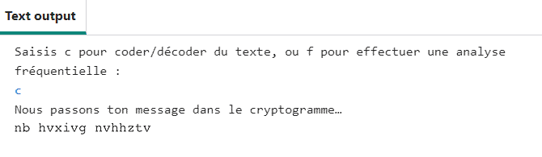

## Créer un menu

Tu vas maintenant créer un système de menu pour que ton utilisateur puisse faire des choix sur ce qu'il veut faire. 

{:width="400px"}

--- task ---

**Trouve** le commentaire de ton code qui dit `# Créer un système de menu basé sur du texte` et commence par définir une fonction appelée `menu()` :

--- code ---
---
language: python
filename: main.py - menu()
line_numbers: true
line_number_start: 41
line_highlights: 42
---
# Créer un système de menu basé sur du texte
def menu():
--- /code ---

--- /task ---

Ton menu a besoin d'une **boucle** qui demande continuellement à l'utilisateur ce qu'il souhaite faire jusqu'à ce qu'il ait saisi un choix valide. Pour commencer, tu vas créer une **variable** appelée `choix` et lui donner la valeur `''`. Cela permettra à la boucle **while** d'exécuter sa première boucle.

--- task ---

Crée une nouvelle variable appelée `choix` et définis la valeur à `''` :

--- code ---
---
language: python
filename: main.py - menu()
line_numbers: true
line_number_start: 41
line_highlights: 43
---
# Créer un système de menu basé sur du texte
def menu():
    choix = ''  # Commencer par une mauvaise réponse pour le choix.

--- /code ---

--- /task ---

### Utiliser une boucle `while` pour obtenir les données de l'utilisateur

Maintenant que tu as défini `choix` à une mauvaise réponse, tu veux créer une **boucle** qui ne s'interrompra que si une `entrée` correspondant à une bonne réponse est donnée. Tu veux une **boucle while** qui s'exécute tant que ta réponse **NE** correspond pas à celle que tu as définie.

--- task ---

Tu peux utiliser une **boucle while** pour exécuter un morceau de code **pendant** qu'une **condition** est **Vraie**. Dans ce cas, tant que l'utilisateur **ne** choisit pas `c` ou `f`, la boucle continuera à s'exécuter. Saisis le code qui définira les **conditions** d'une **boucle while** et demandera à l'utilisateur d'entrer des données :

--- code ---
---
language: python
filename: main.py - menu()
line_numbers: true
line_number_start: 42
line_highlights: 45-46
---
def menu():
    choix = ''  # Commencer par une mauvaise réponse pour le choix.

    while choix != 'c' and choix != 'f':  # Continuer à demander à l'utilisateur la bonne réponse
        choix = input('Saisis c pour coder/décoder du texte, ou f pour effectuer une analyse fréquentielle : ')
--- /code ---

--- /task ---

Une fois que l'utilisateur a donné une réponse correcte, la boucle se termine. Crée ensuite une instruction `if` qui exécutera ta fonction `atbash` si l'utilisateur saisit `c`.

Tu décideras de ce qui se passe lorsqu'un utilisateur saisit `f` dans une étape ultérieure.

--- task ---

Sous la dernière ligne (en veillant à ce qu'il y ait toujours une indentation !), tape :

--- code ---
---
language: python
filename: main.py - menu()
line_numbers: true
line_number_start: 42
line_highlights: 48-52
---
def menu():
    choix = ''  # Commencer par une mauvaise réponse pour le choix.

    while choix != 'c' and choix != 'f':  # Continuer à demander à l'utilisateur la bonne réponse
        choix = input('Saisis c pour coder/décoder du texte, ou f pour effectuer une analyse fréquentielle : ')
    
    if choix == 'c':
        print('Nous passons ton message dans le cryptogramme…')
        message = 'mon message secret' 
        code = atbash(message)
        print(code)

--- /code ---

--- /task ---

--- task ---

Remplace la chaîne qui dit `'mon message secret'` par ce que tu veux. Cette chaîne est le message qui sera codé et décodé.

--- code ---
---
language: python
filename: main.py - menu()
line_numbers: true
line_number_start: 42
line_highlights: 50
---
def menu():
    choix = ''  # Commencer par une mauvaise réponse pour le choix.

    while choix != 'c' and choix != 'f':  # Continuer à demander à l'utilisateur la bonne réponse
        choix = input('Saisis c pour coder/décoder du texte, ou f pour effectuer une analyse fréquentielle : ')
    
    if choix == 'c':
        print('Nous passons ton message dans le cryptogramme…')
        message = 'mon message secret'
        code = atbash(message)
        print(code)

--- /code ---

--- /task ---

--- task ---

À la fin de ta fonction `main()`, tape `menu()` pour appeler la fonction `menu` lors de l'exécution du programme :

--- code ---
---
language: python
filename: main.py - main()
line_numbers: true
line_number_start: 54
line_highlights: 58
---
# Démarrage
def main():
    creer_code()
    # print(atbash('Test'))
    menu()

--- /code ---

--- /task ---

--- task ---

**Test :** exécute ton code. Tape `c` et appuie sur <kbd>Entrée</kbd> pour coder ta chaîne de messages !

{:width="400px"}

**Débogage :** si tu vois un message concernant une erreur d'indentation :
- Vérifie que tu as correctement indenté tout ton code
- Reporte-toi à l'exemple de code de cette page pour t'aider à vérifier

**Débogage :** si tu vois le message d'erreur `c n'est pas défini` lorsque tu exécutes ton code, vérifie que tu as bien utilisé des apostrophes ('') autour de ton c dans la condition `choix !='c'`.

**Débogage :** si rien ne se passe lorsque tu appuies sur `c`, vérifie que tu as correctement orthographié `message`.

--- /task ---

Dans l'étape suivante, tu utiliseras ta fonction `atbash()` pour coder le contenu d'un fichier texte.

--- save ---
