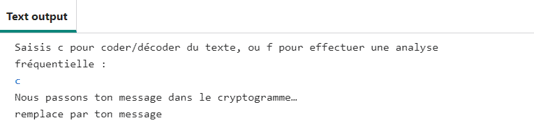

## Coder du texte à partir d'un fichier

Il est temps de coder un message à partir d'un fichier texte.

{:width="400px"}

Le chargement du texte à partir d'un fichier est plus efficace que la saisie ou le collage d'une grande chaîne dans un programme. Il y a moins de possibilités de « casser » ton code en changeant le nom d'un seul fichier cible qu'en copiant et collant de grands blocs de texte à chaque fois.

--- task ---

Trouve le commentaire `# Récupérer et renvoyer le texte d'un fichier` puis définis une fonction `obtenir_texte()`. Cette fonction a un paramètre appelé `filename`. Utilise le `nom de fichier` pour ouvrir le fichier et le lire dans la variable `texte`, puis **retourne** la variable `texte`.

--- code ---
---
language: python
filename: main.py - get_text()
line_numbers: true
line_number_start: 37
line_highlights: 38-42
---
# Récupérer et renvoyer le texte d'un fichier
def obtenir_texte(filename):
    with open(filename) as f:
        texte = f.read().replace('\n','')  # Nécessité de supprimer les caractères de retour à la ligne

    return texte
--- /code ---

--- /task ---

--- task ---

La fonction `menu()` doit coder un message secret à partir d'un fichier texte. **Remplace** ton message secret avec l'appel de la fonction `obtenir_texte()`. Saisis le nom du fichier `input.txt` comme **argument**.

--- code ---
---
language: python
filename: main.py - menu()
line_numbers: true
line_number_start: 52
line_highlights: 54
---
    if choix == 'c':
        print('Nous passons ton message dans le cryptogramme…')
        message = obtenir_texte('input.txt')  # Prendre des données dans un fichier
        code = atbash(message)
        print(code)
--- /code ---

--- /task ---

Tu peux maintenant **ajouter** ton propre message secret au fichier `input.txt`.

--- task ---

Trouve le fichier `input.txt` dans ton Code Editor pour accéder au contenu du fichier texte. Supprime le texte `remplace par ton message` et saisis ton propre message secret.

--- /task ---

--- task ---

**Test :** exécute ton code pour voir s'il affiche ton message codé après avoir saisi la lettre 'c' à l'invite.

**Débogage :** ton message codé ne ressemble pas exactement au message dans la capture d'écran :
- C'est normal. Il s'agit du message codé pour le texte `remplace par ton message`. Ton message sera différent.

**Débogage :** tu vois un message d'erreur qui dit `TypeError: obtenir_texte() takes exactly 1 arguments` :
- Vérifie que tu as bien saisi `input.txt` entre parenthèses à la ligne 57

**Débogage :** tu vois apparaître un message `Indentation error` :
- Vérifie que tu as correctement indenté tout ton nouveau code. Revois les tâches ci-dessus pour vérifier.

--- /task ---

### Décoder le message

Le cryptogramme atbash **code** un message en utilisant les lettres inversées de l'alphabet. Cela signifie qu'exactement le même code peut être utilisé pour **décoder** le message. Tu peux tester cela en prenant ton message codé, en le copiant et en le collant dans ton fichier `input.txt` et en exécutant à nouveau le code.

--- task ---

**Exécute** ton code pour qu'il affiche ton message codé. **Sélectionne** le message codé et copie-le. Retourne à `input.txt` et supprime ton message. Ensuite, **colle** ton nouveau message dans le fichier vide.

N'oublie pas que ton code convertit tout texte en minuscules, tu verras donc ton message en lettres minuscules.

--- collapse ---
---
title: Copier et coller
---

Tu peux copier du texte et coller une copie à un autre endroit.

 1. Sélectionne le texte que tu veux copier en faisant glisser ta souris dessus tout en maintenant le bouton gauche enfoncé.
 2. Copie le texte en utilisant le menu de ton navigateur - choisis **Editer** > **Copier**. Tu peux aussi utiliser un raccourci clavier - <kbd>Ctrl</kbd>+<kbd>C</kbd> sous Windows ou Linux, ou <kbd>Cmd</kbd>+<kbd>C</kbd> sur Mac.
 3. Déplace ton curseur de texte (la ligne clignotante qui indique l'endroit où tu es en train de taper) à l'endroit où tu veux placer une copie du texte.
 4. Colle le texte en utilisant le menu de ton navigateur - choisis **Editer** > **Coller**. Tu peux aussi utiliser un raccourci clavier - <kbd>Ctrl</kbd>+<kbd>V</kbd> sous Windows ou Linux, ou <kbd>Cmd</kbd>+<kbd>V</kbd> sur Mac.

--- /collapse ---

--- /task ---

--- task ---

**Test :** exécute à nouveau ton code et appuie sur 'c' lorsque tu y es invité. Il affichera la version **décodée** de ton message original.

**Débogage :** il affiche toujours le message codé :
- Assure-toi d'avoir copié et collé le message **codé** dans `input.txt`

--- /task ---

Dans l'étape suivante, tu écriras le code pour **analyser la fréquence** des lettres dans ton fichier texte.

--- save ---
