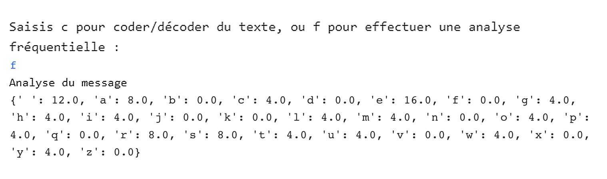

## Créer un analyseur fréquentiel

Dans cette étape, tu coderas une fonction d'analyseur fréquentiel pour déterminer combien de fois chaque lettre de l'alphabet apparaît dans ton texte. 

L'analyse fréquentielle mesure la fréquence d'apparition d'un élément afin que tu puisses rechercher des modèles dans ces données. Il est possible de décoder les codes monoalphabétiques (si tu connais la langue dans laquelle le message est rédigé) en examinant la fréquence d'apparition de chaque lettre et en la faisant correspondre aux [lettres les plus couramment utilisées] (http://letterfrequency.org/letter-frequency-by-language/) dans cette langue. Cela sera expliqué plus en détail par la suite.

Tu dois maintenant créer une fonction qui prendra ton texte et le convertira en une seule casse (pour éviter toute confusion), comptera le nombre de fois où chaque lettre du message apparaît, puis convertira ce nombre en un pourcentage de l'ensemble afin que tu puisses le comparer à la fréquence des lettres en anglais.

--- task ---

Sous le commentaire qui dit `# Calcule la fréquence de toutes les lettres dans un morceau de texte`, définis une fonction appelée `frequence`, et fais en sorte que la première chose qu'elle fasse soit de convertir ton message en minuscules et d'en faire une liste :

--- code ---
---
language: python filename: main.py - frequency() line_numbers: true line_number_start: 18
line_highlights: 19-20
---
# Calculate the frequency of all letters in a piece of text
def frequency(text): text = list(text.lower())  # Convert the message to lower case and make it a list --- /code ---

--- /task ---

--- task ---

Crée un dictionnaire appelé `freq` et pour chaque `lettre` de la liste `alphabet` attribue une valeur de `0`. Assure-toi de **garder l'indentation** et de taper :

--- code ---
---
language: python filename: main.py - frequency() line_numbers: true line_number_start: 18
line_highlights: 22-24
---
# Calculate the frequency of all letters in a piece of text
def frequency(text): text = list(text.lower())  # Convert the message to lower case and make it a list

    freq = {}  # Create a dictionary of every letter, with a count of 0
    for letter in alphabet:
        freq[letter] = 0
--- /code ---

--- /task ---

--- task ---

La prochaine chose que tu dois faire avec ta fonction est de compter toutes les lettres du message. Crée une variable appelée `total_lettres` et affecte la longueur du texte à cette variable.

Assure-toi de **garder l'indentation** comme indiqué dans ce code.

--- code ---
---
language: python filename: main.py - frequency() line_numbers: true line_number_start: 18
line_highlights: 26
---
# Calculate the frequency of all letters in a piece of text
def frequency(text): text = list(text.lower())  # Convert the message to lower case and make it a list

    freq = {}  # Create a dictionary of every letter, with a count of 0
    for letter in alphabet:
        freq[letter] = 0
    
    total_letters = len(text)  # Count the letters in the message
--- /code ---

--- /task ---

Une fois que tu connais la longueur du message, tu peux commencer à compter les lettres qu'il contient pour déterminer leur fréquence d'apparition.

--- task ---

Crée une boucle `for` pour compter chaque fois que chaque lettre apparaît dans le texte. Laisse une ligne blanche à la fin de ton script, assure-toi de conserver l'indentation, et ajoute :

--- code ---
---
language: python filename: main.py - frequency() line_numbers: true line_number_start: 18
line_highlights: 28-30
---
# Calculate the frequency of all letters in a piece of text
def frequency(text): text = list(text.lower())  # Convert the message to lower case and make it a list

    freq = {}  # Create a dictionary of every letter, with a count of 0
    for letter in alphabet:
        freq[letter] = 0
    
    total_letters = len(text)  # Count the letters in the message
    
    for letter in text:
        if letter in freq:
            freq[letter] += 1
--- /code ---

--- /task ---

--- collapse ---
---
title: Compter les lettres
---

--- code ---
---
language: python filename: main.py line_numbers: false line_number_start:
line_highlights:
---

    for letter in text:
        if letter in freq:
            freq[letter] += 1
--- /code ---

Cette section du code examine chacune des lettres de ton message `texte`, et si la lettre apparaît dans ta liste de fréquences, elle ajoute `1` à la valeur de cette lettre. Plus une lettre apparaît souvent, plus cette valeur sera élevée. Une fois que tu sais combien de fois chaque lettre apparaît, tu peux alors convertir ce décompte en un pourcentage de l'ensemble du message (puisque tu connais sa longueur). Tous les caractères qui ne figurent pas dans le dictionnaire - comme la ponctuation - seront ignorés et n'apparaîtront pas dans le message.

--- /collapse ---

--- task ---

Crée une `boucle` qui convertit le nombre de fois où les lettres apparaissent en un pourcentage du message entier.

--- code ---
---
language: python filename: main.py - frequency() line_numbers: true line_number_start: 18
line_highlights: 32-33
---
# Calculate the frequency of all letters in a piece of text
def frequency(text): text = list(text.lower())  # Convert the message to lower case and make it a list

    freq = {}  # Create a dictionary of every letter, with a count of 0
    for letter in alphabet:
        freq[letter] = 0
    
    total_letters = len(text)  # Count the letters in the message
    
    for letter in text:
        if letter in freq: 
            freq[letter] += 1
    
    for letter in freq:
        freq[letter] = freq[letter] / total_letters * 100  # Convert from counts to percentages
--- /code ---

--- /task ---

--- task ---

**Renvoie** le dictionnaire des fréquences pour qu'il puisse être utilisé ailleurs dans ton code. Laisse une ligne vierge et tape :

--- code ---
---
language: python filename: main.py - frequency() line_numbers: true line_number_start: 18
line_highlights: 35
---
# Calculate the frequency of all letters in a piece of text
def frequency(text): text = list(text.lower())  # Convert the message to lower case and make it a list

    freq = {}  # Create a dictionary of every letter, with a count of 0
    for letter in alphabet:
        freq[letter] = 0
    
    total_letters = len(text)  # Count the letters in the message
    
    for letter in text:
        if letter in freq: 
            freq[letter] += 1
    
    for letter in freq:
        freq[letter] = freq[letter] / total_letters * 100  # Convert from counts to percentages
    
    return freq
--- /code ---

--- /task ---

### Élargir le menu pour inclure 'f'

Maintenant que tu as une fonction capable de calculer la fréquence des lettres dans ton message, tu dois la relier à ton menu utilisateur. Pour l'instant, l'utilisateur ne peut choisir que la lettre 'c' pour coder ou décoder un message. S'ils tapent la lettre 'f', rien ne se passe. Tu vas maintenant ajouter l'option 'f' pour analyser la fréquence des lettres de ton message en appelant ta nouvelle fonction.

Sous ta première instruction `if` demandant à l'utilisateur de sélectionner 'c', tu dois ajouter une instruction `elif` pour que l'utilisateur puisse choisir l'option d'analyse et d'impression de la fréquence des lettres en appuyant sur 'f'.

--- task ---

Laisse une ligne vide après l'instruction `if` et, à la ligne 72, tape :

--- code ---
---
language: python filename: main.py - menu() line_numbers: true line_number_start: 63
line_highlights: 72-76
---

    while choice != 'c' and choice != 'f':  # Keep asking the user for the right answer
        choice = input('Please enter c to encode/decode text, or f to perform frequency analysis: ')
    
    if choice == 'c':
        print('Running your message through the cypher…')
        message = get_text('input.txt')  # Take input from a file 
        code = atbash(message)
        print(code)
    
    elif choice == 'f':
        print('Analysing message…')
        message = get_text('input.txt')
        message_freq = frequency(message)
        print(message_freq)
--- /code ---

--- /task ---

--- task ---

Enregistre et exécute ton code. Choisis 'f' à l'invite et tu verras apparaître dans la console la fréquence des lettres de ton message. Les valeurs que tu verras dans ton message seront différentes des valeurs indiquées ici :

--- /task ---

Dans l'étape suivante, tu afficheras les données de l'analyse fréquentielle sous la forme d'un graphique sympa !

--- save ---
