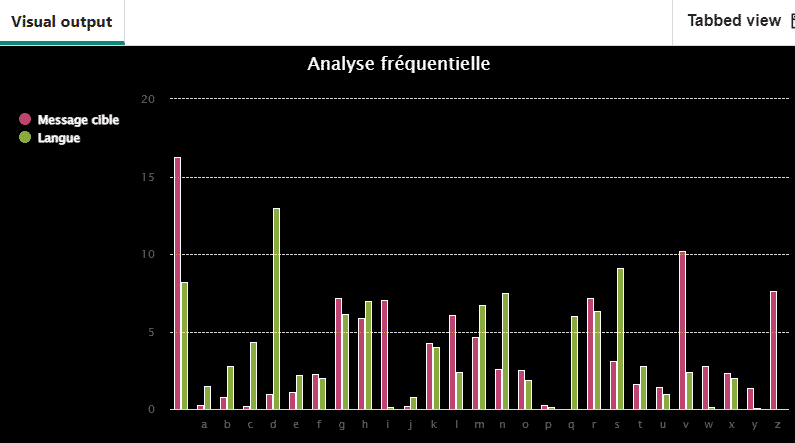

## Analyser la fréquence

Utilise un diagramme à barres pour analyser la fréquence des lettres dans un message codé. 

{:width="400px"}

Dans toutes les langues, chaque lettre de l'alphabet a une « personnalité » ou un ensemble de traits lorsqu'elle est utilisée dans cette langue. L'un des traits les plus évidents qu'une lettre possède dans n'importe quelle langue est sa fréquence d'apparition. **L'analyse fréquentielle** est la méthode qui permet de casser les codes en examinant la fréquence d'utilisation des lettres dans la langue du code et en la comparant à la fréquence d'apparition des lettres codées dans un message. En anglais, la lettre **e** est la plus utilisée (elle apparaît 12,8 % du temps), suivie de **t** (à 9,1 %). La lettre la moins souvent utilisée est **z**.

--- task ---

La ligne de code `print(message_freq)` n'est plus nécessaire. Ajoute un `#` au début de celui-ci pour que Python l'ignore lors de l'exécution du code.

--- code ---
---
language: python filename: main.py - menu() line_numbers: true line_number_start: 72
line_highlights: 76
---

    elif choice == 'f':
        print('Analysing message…')
        message = get_text('input.txt')  # Take input from the same file. We have a 'longer.txt' or similar containing cyphertext we know to perform reasonably well for frequency analysis
        message_freq = frequency(message)  # Get the frequency of the letters in the message, as %
        # print(message_freq)
--- /code ---

--- /task ---

### Faire fonctionner le diagramme de fréquence

--- task ---

Trouve le commentaire `# Faire un graphique de fréquence` et crée une nouvelle fonction appelée `faire_graphique()`. Cette fonction a besoin de deux paramètres appelés `texte` et `langue`. Le graphique de fréquence sera un diagramme à **barres** avec le **titre** `Analyse fréquentielle` et avec des étiquettes **axe des x** utilisant les **clés** du dictionnaire `freq`.

Les valeurs du dictionnaire `freq` seront transmises à la fonction lorsqu'elle sera appelée plus loin dans le code, via le paramètre `texte`.

--- code ---
---
language: python filename: main.py - make_chart() line_numbers: true line_number_start: 36
line_highlights: 37-38
---
# Make frequency chart
def make_chart(text, language): chart = Bar(width=800, height=400, title='Frequency analysis', x_labels = list(text.keys())) --- /code ---

--- /task ---

--- task ---

Étiquette le graphique avec la **fréquence** des lettres dans le message codé et la fréquence connue des lettres de la **langue** dans laquelle le message est rédigé. Ces données ont été **passées dans** la **fonction** via les paramètres `texte` et `langue`.

--- code ---
---
language: python filename: main.py - make_chart() line_numbers: true line_number_start: 36
line_highlights: 39-40
---
# Make frequency chart
def make_chart(text, language): chart = Bar(width=800, height=400, title='Frequency analysis', x_labels = list(text.keys())) chart.add('Target message', list(text.values()))  # Label the frequency data for the encoded message chart.add('Language', list(language.values()))  # Label the frequency data for the language --- /code ---

--- /task ---

--- task ---

**Fais un rendu** du graphique pour qu'il s'affiche lorsque la fonction est appelée.

--- code ---
---
language: python filename: main.py - make_chart() line_numbers: true line_number_start: 36
line_highlights: 42
---
# Make frequency chart
def make_chart(text, language): chart = Bar(width=800, height=400, title='Frequency analysis', x_labels = list(text.keys())) chart.add('Target message', list(text.values()))  # Label the frequency data for the encoded message chart.add('Language', list(language.values()))  # Label the frequency data for the language

    chart.render()
--- /code ---

--- /task ---

### Appelle la fonction de diagramme de fréquence

--- task ---

Trouve ton `elif` dans la fonction `menu()`. Ajoute une ligne de code qui va **importer** le dictionnaire de fréquence `anglais` depuis le fichier `frequency.py`. Ajoute une autre ligne de code qui **appellera** la fonction `faire_graphique` pour dessiner le graphique.

--- code ---
---
language: python filename: main.py - menu() line_numbers: true line_number_start: 75
line_highlights: 80-81
---

    elif choice == 'f':
        print('Analysing message…')
        message = get_text('input.txt')  # Take input from the same file. We have a 'longer.txt' or similar containing cyphertext we know to perform reasonably well for frequency analysis
        message_freq = frequency(message)  # Get the frequency of the letters in the message, as %
        # print(message_freq)
        lang_freq = english  # Import the English frequency dictionary
        make_chart(message_freq, lang_freq)  # Call the function to make a chart
--- /code ---

--- /task ---

--- task ---

**Test :** exécute ton code pour afficher le diagramme à barres d'analyse fréquentielle.

**Débogage :** ton graphique ne ressemble pas exactement à celui affiché dans l'image ci-dessus :
- C'est normal. Ton graphique affichera les données de fréquence pour le message secret que tu as saisi dans `input.txt`.

**Débogage :** tu vois le message d'erreur suivant `NameError: name 'lang_freq' is not defined` :
- Vérifie que tu as ajouté la ligne de code `lang_freq = anglais` **avant** l'appel à la fonction `faire_graphique()`.

**Débogage :** tu vois apparaître un message `Indentation error` :
- Vérifie que tu as correctement indenté tout ton nouveau code. Revois les tâches ci-dessus pour vérifier.

--- /task ---

### Analyser le diagramme de fréquence

Le graphique réalisé montre la fréquence des lettres de la langue anglaise, étiquetée **Langue**. Tu peux voir que la lettre **e** est la lettre la plus utilisée dans la langue anglaise parce qu'elle a la barre la plus élevée pour toutes les valeurs de **langue**.

Le diagramme de fréquence répertorie également la fréquence des lettres dans ton message **codé**, étiqueté comme **Message cible**. Cela inclut les espaces de ton message, qui sont visibles dans la dernière barre à droite. Pour savoir quel **codage** a été utilisé pour ce message, tu peux comparer les barres affichant la langue anglaise avec les barres du message codé. La barre la plus haute (en ignorant les espaces) dans le texte du message codé sera très probablement un **e**. La deuxième lettre la plus élevée sera probablement un **t** car c'est la lettre suivante la plus populaire.

Les déchiffreurs de code peuvent utiliser la fréquence des lettres pour déterminer le type de codage utilisé pour le message. Ils peuvent utiliser l'essai et l'erreur pour **prédire** ce qu'une lettre peut représenter en utilisant le graphique comme guide.

--- task ---

Ton message secret est assez petit, ce qui le rend délicat à analyser à l'aide d'un diagramme de fréquence. Modifie ton code pour qu'il analyse le message dans `longer.txt` à la place.

Remplace `input.txt` par `longer.txt`.

--- code ---
---
language: python filename: main.py - menu() line_numbers: true line_number_start: 75
line_highlights: 77
---

    elif choice == 'f':
        print('Analysing message…')
        message = get_text('longer.txt') 
        message_freq = frequency(message)  # Get the frequency of the letters in the message, as %
--- /code ---

--- /task ---

--- task ---

**Analyse** le graphique de fréquence en examinant les valeurs **Langue** et les valeurs **Message cible**. Remarque que la barre la plus haute pour **Langue** est **e** et que la barre la plus haute pour **Message cible** est **v**. C'est parce qu'avec le cryptage **Atbash**, la lettre **e** est codée avec la lettre **v**.

--- /task ---

--- save ---
