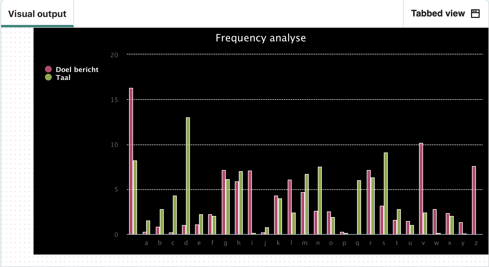

  <a class="c-survey-banner__link" href="https://form.raspberrypi.org/f/code-editor-feedback" target="_blank">Vul onze enquête in</a> om onze Code Editor te helpen verbeteren!

## Wat ga je maken

Analyseer een grafiek om de code te kraken en leer tegelijkertijd over lijsten en functies.

Je gaat:
+ Een functie definiëren die parameters gebruikt en een waarde teruggeeft
+ `While` en `for` lussen gebruiken om taken te herhalen
+ Een grafiek maken om frequentie data weer te geven

--- no-print ---

### Afspelen ▶️

--- task ---

  

Dit programma kan een geheim bericht uit een bijgevoegd `.txt`-bestand **coderen** of **decoderen**, of het kan **de frequentie analyseren** van letters in een bericht. Deze gegevens worden weergegeven in een frequentiegrafiek, die laat zien hoe vaak elke letter in het geheime bericht voorkomt.

Voer het programma twee keer uit om te ontdekken hoe het werkt: 
+ Kies eerst 'c' om een bericht te decoderen dat is opgeslagen in een bijgevoegd `.txt`-bestand 
+ Voer het programma vervolgens een tweede keer uit en kies 'f' bij de prompt; hierdoor wordt een letter frequentie grafiek voor het bericht weergegeven.

<iframe src="https://editor.raspberrypi.org/nl-NL/embed/viewer/codebreaker-project-example" width="600" height="600" frameborder="0" marginwidth="0" marginheight="0" allowfullscreen>
</iframe>

--- /task ---

--- /no-print ---

De Atbash cypher is een van 's werelds oudst bekende cypher (een cypher is een geheime of verkapte manier van schrijven). Oorspronkelijk ontwikkeld in de Hebreeuwse taal, wordt het alfabet in de omgekeerde volgorde gebruikt om een geheime boodschap te creëren. De naam is afgeleid van de eerste, laatste, tweede en voorlaatste Hebreeuwse letters: Aleph, Taw, Bet, en Shin.

--- print-only ---

--- /print-only ---