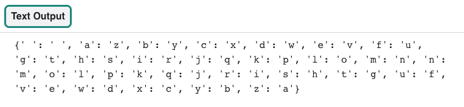

## Codeer het alfabet

<div style="display: flex; flex-wrap: wrap">
<div style="flex-basis: 200px; flex-grow: 1; margin-right: 15px;">
Om te beginnen maak je een dictionary voor je gecodeerde brieven. 
</div>
<div>
{:width="600px"}
</div>
</div>

--- task ---

Open het [Codekraker-startproject](https://editor.raspberrypi.org/en/projects/codebreaker-project-starter){:target="_blank"}. De Raspberry Pi code-editor wordt geopend in een ander browsertabblad.

Als je een Raspberry Pi-account hebt, kun je op de **Save knop** klikken om een kopie van de startercode op te slaan in je bibliotheek.

Als je de code editor niet gebruikt in je browser, moet je de projectbestanden downloaden en misschien `pygal` installeren voordat je deze kunt importeren.

--- collapse ---
---
title: Pygal installeren
---

### In Windows
In de **opdrachtprompt** typ je het volgende en druk je op de <kbd>Enter</kbd> toets:

```
pip install pygal
```

Wacht tot de installatie is voltooid en ga vervolgens verder met het project.

### Op een Mac
In de **Terminal** typ je het volgende en druk je op de <kbd>Enter</kbd> toets:

```
pip3 install pygal
```

Wacht tot de installatie is voltooid en ga vervolgens verder met het project.

### Op Linux, inclusief Raspberry Pi OS
In de **Terminal** typ je het volgende en druk je op de <kbd>Enter</kbd> toets:

```
pip install pygal
```

Wacht tot de installatie is voltooid en ga vervolgens verder met het project.

--- /collapse ---

--- /task ---

### Stel de alfabetlijst en de code dictionary in

Het codekrakerprogramma begint met twee datastructuren. De eerste gegevensstructuur is een **lijst** van alle letters in het alfabet en de tweede is een `code` **dictionary**. Om tijd te besparen tijdens het typen, kun je een lijst van een string maken met behulp van de `list()` functie.

[[[list-function]]]

--- task ---

Zoek de `# Gegevensstructuren instellen` comment in het programma, gebruik dan de functie `list()` om een **lijst** van letters uit het `alfabet` te maken. **Initialiseer** vervolgens de `code` **dictionary** zodat je deze in een latere stap kunt invullen.

De `alfabet` lijst bevat spaties aan het begin en einde om de spaties in het bericht te behouden. Sterke encryptie zou dit niet doen, omdat het bericht daardoor gemakkelijker te decoderen is. Voor dit project zijn de spaties behouden om de berichten gemakkelijker leesbaar te maken.

--- code ---
---
language: python filename: main.py line_numbers: true line_number_start: 5
line_highlights: 6-7
---
# Gegevensstructuren instellen
alphabet = list(' abcdefghijklmnopqrstuvwxyz ')  # List from a string code = {}

--- /code ---

--- /task ---

### Maak een nieuwe lijst die het alfabet omdraait

Je moet een nieuwe lijst met het alfabet, maar dan van achteren naar voren. Je kunt de functie `list()` opnieuw gebruiken om hierbij te helpen. Je kunt ook de functie `reversed()` gebruiken om een bestaande lijst om te keren.

--- task ---

Zoek de `# Maak de atbash-code door het alfabet om te draaien` commentaar en **definieer** vervolgens een nieuwe functie genaamd `maak_code`. Maak vervolgens een **lijst** die de **omgekeerde** waarden van de `alfabet` lijst bevat.

--- code ---
---
language: python filename: main.py - create_code() line_numbers: true line_number_start: 10
line_highlights: 11-12
---
# Maak de atbash-code door het alfabet om te draaien
def create_code(): backwards = list(reversed(alphabet))  # Reverses a list

--- /code ---

--- /task ---

### Codeer het alfabet

<p style='border-left: solid; border-width:10px; border-color: #0faeb0; background-color: aliceblue; padding: 10px;'>
Encodering is wanneer je gegevens verandert van de ene vorm in een andere. In een atbash cypher zou de letter 'e' bijvoorbeeld **gecodeerd** zijn als 'v'. 
</p>

Je hebt nu twee lijsten. De ene bevat het alfabet in de normale volgorde, de andere bevat het alfabet van achteren naar voren. Je gaat nu deze twee lijsten gebruiken om een dictionary te vullen. De **sleutel** slaat het alfabet in de normale volgorde op en de **gekoppelde waarde** zal het alfabet achterwaarts opslaan.

De code dictionary is erg belangrijk omdat je het kunt gebruiken om elke letter uit je bericht te matchen met behulp van de **sleutel**, met de gecodeerde **gepaarde waarde**.

--- task ---

Binnen je `maak_code` functie, **vul je** de `code` dictionary in met gegevens uit de twee **lijsten**. Gebruik een `for` lus om de lengte van de `alfabet` lijst te bepalen en vul de **dictionary** met de gegevens.

`len()` is een functie die je kunt gebruiken om de lengte van een **object**te achterhalen, zoals een lijst. Het wordt hier gebruikt om een `for` lus te herhalen, net zo vaak als er tekens in de `alfabet` lijst staan — de lengte ervan.

--- code ---
---
language: python filename: main.py - create_code() line_numbers: true line_number_start: 11
line_highlights: 14-15
---
def create_code(): backwards = list(reversed(alphabet))  # Reverses a list

    for i in range(len(alphabet)):  # Gets the length of a list
        code[alphabet[i]] = backwards[i]  # Populate the code dictionary with a letter of the alphabet and its encoded letter
--- /code ---

--- /task ---

Het maken van een `main()` functie is handig om alle vereiste functies **aan te roepen** wanneer je programma voor de eerste keer start.

--- task ---

Zoek de `# Opstart` commentaar en **definieer** een `main()` functie om je `code()` functie aan te roepen. Roep vervolgens de `main()` functie aan in de hoofdtekst van je code.

--- code ---
---
language: python filename: main.py - main() line_numbers: true line_number_start: 37
line_highlights: 38-41
---
# Start up
def main(): create_code()

main() --- /code ---

--- /task ---

### Testen en fouten opsporen

--- task ---

Om te testen of je `code` dictionary correct is ingevuld, kun je de dictionary volledig `afdrukken`. Onder je `for` lus in de `maak_code` functie, voeg je een `print` functie toe om de inhoud weer te geven.

--- code ---
---
language: python filename: main.py - create_code() line_numbers: true line_number_start: 11
line_highlights: 17
---
def create_code(): backwards = list(reversed(alphabet))

    for i in range(len(alphabet)):  #  Gets length of a list
        code[alphabet[i]] = backwards[i]  #  Populates the code dictionary with a letter of the alphabet and its encoded letter
    
    print(code)
--- /code ---

--- /task ---

--- task ---

**Test:** Voer je code uit om te zien of de `code` dictionary correct wordt weergegeven. Je zou een patroon moeten zien dat begint met de letter `a` gecombineerd met `z` en de letter `b` gecombineerd met `y`.


{:width="600px"}

**Fouten opsporen:** Er zijn geen foutmeldingen maar je code dictionary wordt niet weergegeven op het scherm:
- Zorg ervoor dat `print(code)` correct is ingesprongen in de functie `maak_code`
- Controleer of je de **aanroep** van `maak_code()` en de `main()` functie correct hebt gedaan

**Fouten opsporen:** Als je een bericht ziet over `code` niet wordt gedefinieerd, zorg ervoor dat je de `code` dictionary hebt geïnitialiseerd.

**Fouten opsporen:** Als je een bericht ziet over een inspringfout:
- Controleer of je al je code correct hebt ingesprongen
- Kijk terug naar de voorbeeldcode op deze pagina om je te helpen het controleren

--- /task ---

In de volgende stap zul je **een bericht** coderen met behulp van je `code` dictionary.

--- save ---
