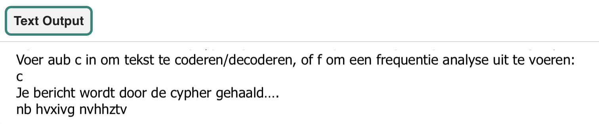

## Maak een menu

Nu ga je een menusysteem maken voor je gebruiker om keuzes te maken over wat ze willen doen. 

{:width="400px"}

--- task ---

**Zoek** de opmerking `# Maak een op tekst gebaseerd menusysteem` in je code en maak een functie `menu()`:

--- code ---
---
language: python
filename: main.py - menu()
line_numbers: true
line_number_start: 41
line_highlights: 42
---
# Maak een tekst-gebaseerd menu systeem
def menu():
--- /code ---

--- /task ---

Je menu heeft een **lus** nodig die de gebruiker voortdurend vraagt wat hij wil doen, totdat hij een geldige keuze heeft ingevoerd. Om dit te beginnen, maak een **variabele** `keuze` en stel deze in op `''`. Hierdoor kan de lus **while** zijn eerste lus uitvoeren.

--- task ---

Maak een nieuwe variabele met de naam `keuze` en stel de waarde in op `''`:

--- code ---
---
language: python
filename: main.py - menu()
line_numbers: true
line_number_start: 41
line_highlights: 43
---
# Maak een tekst-gebaseerd menu systeem
def menu():
    keuze = ''  # Begin met een verkeerd antwoord voor keuze.

--- /code ---

--- /task ---

### Gebruik een `while` lus om gebruikersinvoer te krijgen

Nu dat je `keuze` op een fout antwoord hebt ingesteld, ga je een **lus** maken die alleen wordt onderbroken als de `invoer` een juist antwoord is. Je wilt een **while-lus** die loopt zolang je antwoord **NIET** overeenkomt met het antwoord dat je hebt gedefinieerd.

--- task ---

Je kunt een **while lus** gebruiken om een stukje code uit te voeren **terwijl** een **voorwaarde** gelijk is aan **Waar**. In dit geval zal de lus doorgaan zolang de gebruiker **geen** `c` of `f` kiest. Voer de code in die de **voorwaarden** instelt voor een **while-lus** en vraag de gebruiker om invoer:

--- code ---
---
language: python
filename: main.py - menu()
line_numbers: true
line_number_start: 42
line_highlights: 45-46
---
def menu():
    keuze = ''  # Begin met een verkeerd antwoord voor keuze.

    while keuze != 'c' and keuze != 'f':  # Blijf de gebruiker om het juiste antwoord vragen
        keuze = input('Voer c in om tekst te coderen/decoderen, of f om frequentieanalyse uit te voeren: ')
--- /code ---

--- /task ---

Zodra de gebruiker een juist antwoord heeft gegeven, eindigt de lus. Maak vervolgens een `if` statement die je `atbash` functie uitvoert als de gebruiker `c` invoert.

Je beslist pas in een latere stap wat er gebeurt wanneer een gebruiker `f` invoert.

--- task ---

Typ onder de laatste regel (zorg ervoor dat er nog steeds een inspringing is!):

--- code ---
---
language: python
filename: main.py - menu()
line_numbers: true
line_number_start: 42
line_highlights: 48-52
---
def menu():
    keuze = ''  # Begin met een verkeerd antwoord voor keuze.

    while keuze != 'c' and keuze != 'f':  # Blijf de gebruiker om het juiste antwoord vragen
        keuze = input('Voer c in om tekst te coderen/decoderen, of f om frequentieanalyse uit te voeren: ')

    if keuze == 'c':
        print('Voer je bericht uit via de cypher…')
        bericht = 'mijn geheime bericht' 
        code = atbash(bericht)
        print(code)

--- /code ---

--- /task ---

--- task ---

Verander de string met de tekst `'mijn geheime bericht'` in wat je maar wilt. Deze string is het bericht dat zal worden gecodeerd en gedecodeerd.

--- code ---
---
language: python
filename: main.py - menu()
line_numbers: true
line_number_start: 42
line_highlights: 50
---
def menu():
    keuze = ''  # Begin met een verkeerd antwoord voor keuze.

    while keuze != 'c' and keuze != 'f':  # Blijf de gebruiker om het juiste antwoord vragen
        keuze = input('Voer c in om tekst te coderen/decoderen, of f om frequentieanalyse uit te voeren: ')
    
    if keuze == 'c':
        print('Voer je bericht uit via de cypher…')
        bericht = 'mijn geheime bericht'
        code = atbash(bericht)
        print(code)

--- /code ---

--- /task ---

--- task ---

Aan het einde van de functie `main()` typ je `menu()` om de functie `menu` aan te roepen het programma loopt:

--- code ---
---
language: python
filename: main.py - main()
line_numbers: true
line_number_start: 54
line_highlights: 58
---
# Opstart
def main():
    maak_code()
    # print(atbash('Test'))
    menu()

--- /code ---

--- /task ---

--- task ---

**Test:** Voer je code uit. Typ `c` en druk op <kbd>Enter</kbd> om je berichtenreeks te coderen!

{:width="400px"}

**Fouten opsporen:** Als je een bericht ziet over een inspringfout:
- Controleer of je al je code correct hebt ingesprongen
- Kijk terug naar de voorbeeldcode op deze pagina om je te helpen het controleren

**Fouten opsporen:** Als je de foutmelding `c ziet is niet gedefinieerd` wanneer je de code uitvoert. Controleer of er apostrofen ('') rond je c in de voorwaarde `keuze ! = 'c'`.

**Foutopsporing:** Als er niets gebeurt wanneer je op `c` drukt, controleer dan of je `bericht` correct hebt gespeld.

--- /task ---

In de volgende stap gebruik je de functie `atbash()` om de inhoud van een tekstbestand te coderen.

--- save ---
