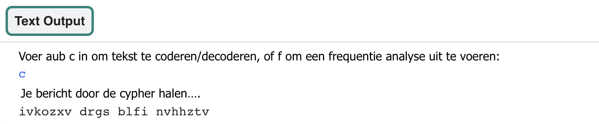
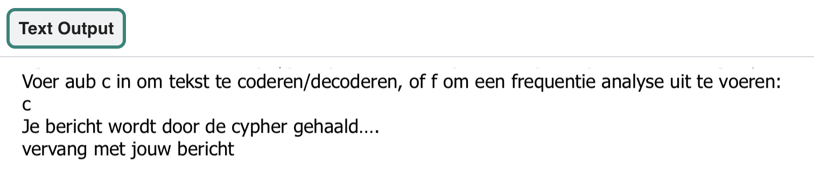

## Codeer tekst uit een bestand

Het is tijd om een bericht uit een tekstbestand te coderen.

{:width="400px"}

Het laden van de tekst uit een bestand is efficiënter dan het typen of plakken van een grote reeks in een programma. Er is minder kans om je code te 'breken' bij het wijzigen van de naam van een enkel doelbestand, dan wanneer je telkens grote blokken tekst kopieert en plakt.

--- task ---

Zoek de `# Haal tekst op en retourneer deze uit een bestand` opmerking en definieer vervolgens een `haal_tekst()` functie. Deze functie heeft één parameter `bestandsnaam`. Gebruik de `bestandsnaam` om het bestand te openen en het in te lezen in de `tekst` variabele, en **stuur** dan de `tekst` variabele terug.

--- code ---
---
language: python filename: main.py - get_text() line_numbers: true line_number_start: 37
line_highlights: 38-42
---
# Fetch and return text from a file
def get_text(filename): with open(filename) as f: text = f.read().replace('\n','')  # Need to strip the newline characters

    return text
--- /code ---

--- /task ---

--- task ---

De functie `menu()` moet een geheim bericht uit een tekstbestand coderen. **Vervang** je geheime bericht door de functieaanroep `haal_tekst()`. Voer de naam van het bestand `input.txt` in als een **argument**.

--- code ---
---
language: python filename: main.py - menu() line_numbers: true line_number_start: 52
line_highlights: 54
---

    if choice == 'c':
        print('Running your message through the cypher…')
        message = get_text('input.txt')  # Take input from a file
        code = atbash(message)
        print(code)
--- /code ---

--- /task ---

Je kunt nu je eigen geheime bericht **toevoegen** aan het `input.txt` bestand.

--- task ---

Zoek het bestand `input.txt` in je code-editor om toegang te krijgen tot de inhoud van het tekstbestand. Verwijder de `vervang door jouw bericht` tekst en voer je eigen geheime bericht in.

--- /task ---

--- task ---

**Test:** Voer je code uit om te zien of je gecodeerde bericht wordt weergegeven nadat je de letter 'c' hebt ingevoerd wanneer je erom vraagt.

**Foutoplossing:** Je gecodeerde bericht lijkt niet precies op het bericht in de schermafbeelding:
- Dat is normaal. Dit is het gecodeerde bericht voor de tekst `vervang door jouw bericht`. Jouw bericht zal anders zijn.

**Fouten opsporen:** Je ziet de foutmelding `TypeError: get_text() takes exactly 1 arguments`:
- Controleer of je `input.txt` tussen de ronde haakjes op regel 57 hebt ingevoerd

**Foutopsporing:** Je ziet een `indentation error` (inspring fout) bericht:
- Controleer of je al je nieuwe code correct hebt ingesprongen. Bekijk de bovenstaande taken nogmaals om dit te controleren.

--- /task ---

### Ontcijfer het bericht

De atbash-codering **codeert** een bericht met behulp van de omgekeerde letters van het alfabet. Dit betekent dat exact dezelfde code kan worden gebruikt om het bericht te **decoderen**. Je kunt dit testen door je gecodeerde bericht te kopiëren en in je `input.txt` bestand te kopiëren en de code opnieuw uit te voeren.

--- task ---

**Voer** je code uit zodat die je gecodeerde bericht toont. **Selecteer** het gecodeerde bericht en kopieer het. Ga terug naar `input.txt` en verwijder je bericht. Vervolgens **plak** je nieuwe bericht in het lege bestand.

Vergeet niet dat je code elke tekst converteert naar kleine letters, dus je ziet je bericht in kleine letters.

--- collapse ---
---
title: Kopiëren en plakken
---

Je kunt tekst kopiëren en een kopie op een andere plaats plakken.

 1. Selecteer de tekst die je wilt kopiëren door de muis erover te slepen terwijl je de linkerknop ingedrukt houdt.
 2. Kopieer de tekst via het menu van je browser - kies **Bewerken** > **Kopieer**. Je kunt ook een sneltoets gebruiken - <kbd>Ctrl</kbd>+<kbd>C</kbd> op Windows of Linux, of <kbd>Cmd</kbd>+<kbd>C</kbd> op een Mac.
 3. Verplaats je tekstcursor (de knipperende regel die laat zien waar je typt) naar waar je een kopie van de tekst wilt plaatsen.
 4. Kopieer de tekst via het menu van je browser - kies **Bewerken** > **Plakken**. Je kunt ook een sneltoets gebruiken - <kbd>Ctrl</kbd>+<kbd>V</kbd> op Windows of Linux, of <kbd>Cmd</kbd>+<kbd>V</kbd> op een Mac.

--- /collapse ---

--- /task ---

--- task ---

**Test:** Voer je code opnieuw uit en druk op 'c' wanneer daarom wordt gevraagd. Het toont de **gedecodeerde** versie van je oorspronkelijke bericht.

**Fouten opsporen:** Het gecodeerde bericht wordt nog steeds weergegeven:
- Zorg ervoor dat je het **gecodeerde** bericht hebt gekopieerd en geplakt in `input.txt`

--- /task ---

In de volgende stap schrijf je de code om **de frequentie** van letters in je tekstbestand te analyseren.

--- save ---
