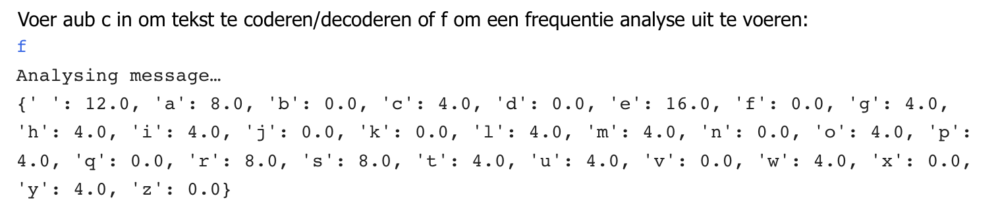

## Maak een frequentie analyser

In deze stap programmeer je een frequentie analyse om uit te vinden hoe vaak elke letter van het alfabet in je tekst verschijnt. 

Frequentie analyse meet hoe vaak iets voorkomt zodat je patronen kunt zoeken in die gegevens. Het is mogelijk om mono-alfabetische cyphers te decoderen (als je de taal kent waarin het bericht zich bevindt) door te kijken hoe vaak elke letter voorkomt en deze te matchen met de [meest gebruikte letters] (http://letterfrequency.org/letter-frequency- by-language/) in die taal. Dit zal later in meer detail worden uitgelegd.

Je moet nu een functie maken die je tekst kan omzetten naar één lettertype (om verwarring te voorkomen), die vervolgens het aantal keren telt dat elke letter in het bericht verschijnt, en dan omzetten dat getal in een percentage van het geheel omzet, zodat je het kunt vergelijken met de frequentie van letters in het Engels.

--- task ---

Onder de opmerking met de tekst `# Bereken de frequentie van alle letters in een stuk tekst`, definieer een functie met de naam `frequentie`en zorg dat er voor dat als eerste activiteit je bericht moet worden omgezet naar kleine letters en daarna een lijst moet worden gemaakt:

--- code ---
---
language: python filename: main.py - frequency() line_numbers: true line_number_start: 18
line_highlights: 19-20
---
# Calculate the frequency of all letters in a piece of text
def frequency(text): text = list(text.lower())  # Convert the message to lower case and make it a list --- /code ---

--- /task ---

--- task ---

Maak een dictionary met de naam `freq` en voor elke `letter` in de lijst `alfabet` wijs een waarde `0` toe. Zorg ervoor dat je **de inspringing behoudt ** typ:

--- code ---
---
language: python filename: main.py - frequency() line_numbers: true line_number_start: 18
line_highlights: 22-24
---
# Calculate the frequency of all letters in a piece of text
def frequency(text): text = list(text.lower())  # Convert the message to lower case and make it a list

    freq = {}  # Create a dictionary of every letter, with a count of 0
    for letter in alphabet:
        freq[letter] = 0
--- /code ---

--- /task ---

--- task ---

Het volgende wat je moet doen is het tellen van alle letters in het bericht. Maak een variabele met de naam `totaal_letters` en wijs de lengte van de tekst toe aan die variabele.

Zorg ervoor dat je **de inspringing** behoudt, zoals weergegeven in deze code.

--- code ---
---
language: python filename: main.py - frequency() line_numbers: true line_number_start: 18
line_highlights: 26
---
# Calculate the frequency of all letters in a piece of text
def frequency(text): text = list(text.lower())  # Convert the message to lower case and make it a list

    freq = {}  # Create a dictionary of every letter, with a count of 0
    for letter in alphabet:
        freq[letter] = 0
    
    total_letters = len(text)  # Count the letters in the message
--- /code ---

--- /task ---

Zodra je weet hoe lang het bericht is, kun je beginnen de letters erin te tellen om te bepalen hoe vaak ze verschijnen.

--- task ---

Maak een `for` lus om het aantal keren dat een letter in de tekst voorkomt te tellen. Laat een lege regel open aan het einde van jouw script, zorg ervoor dat je de inspringing behoudt en voeg toe:

--- code ---
---
language: python filename: main.py - frequency() line_numbers: true line_number_start: 18
line_highlights: 28-30
---
# Calculate the frequency of all letters in a piece of text
def frequency(text): text = list(text.lower())  # Convert the message to lower case and make it a list

    freq = {}  # Create a dictionary of every letter, with a count of 0
    for letter in alphabet:
        freq[letter] = 0
    
    total_letters = len(text)  # Count the letters in the message
    
    for letter in text:
        if letter in freq:
            freq[letter] += 1
--- /code ---

--- /task ---

--- collapse ---
---
title: Tel de letters
---

--- code ---
---
language: python filename: main.py line_numbers: false line_number_start:
line_highlights:
---

    for letter in text:
        if letter in freq:
            freq[letter] += 1
--- /code ---

Dit gedeelte van de code kijkt naar elke letter in de `tekst` van je bericht, en als de letter in je frequentielijst voorkomt, wordt `1` toegevoegd aan de waarde van de letter. Hoe vaker een letter voorkomt, hoe hoger de waarde zal zijn. Zodra je weet hoe vaak elke letter voorkomt, kunt je dit aantal omrekenen naar een percentage van het hele bericht (aangezien je de lengte ervan kent). Tekens die niet in het woordenboek staan - zoals leestekens - worden genegeerd, en zullen niet voorkomen in het bericht.

--- /collapse ---

--- task ---

Maak een `lus` die het aantal keren dat de letters verschijnen omzet in een percentage van het hele bericht.

--- code ---
---
language: python filename: main.py - frequency() line_numbers: true line_number_start: 18
line_highlights: 32-33
---
# Calculate the frequency of all letters in a piece of text
def frequency(text): text = list(text.lower())  # Convert the message to lower case and make it a list

    freq = {}  # Create a dictionary of every letter, with a count of 0
    for letter in alphabet:
        freq[letter] = 0
    
    total_letters = len(text)  # Count the letters in the message
    
    for letter in text:
        if letter in freq: 
            freq[letter] += 1
    
    for letter in freq:
        freq[letter] = freq[letter] / total_letters * 100  # Convert from counts to percentages
--- /code ---

--- /task ---

--- task ---

**Zend** de frequentie dictionary terug zodat deze elders in je code kan worden gebruikt. Laat een lege regel open en type:

--- code ---
---
language: python filename: main.py - frequency() line_numbers: true line_number_start: 18
line_highlights: 35
---
# Calculate the frequency of all letters in a piece of text
def frequency(text): text = list(text.lower())  # Convert the message to lower case and make it a list

    freq = {}  # Create a dictionary of every letter, with a count of 0
    for letter in alphabet:
        freq[letter] = 0
    
    total_letters = len(text)  # Count the letters in the message
    
    for letter in text:
        if letter in freq: 
            freq[letter] += 1
    
    for letter in freq:
        freq[letter] = freq[letter] / total_letters * 100  # Convert from counts to percentages
    
    return freq
--- /code ---

--- /task ---

### Breid het menu uit met 'f'

Nu je een functie hebt die de frequentie van de letters in je bericht kan berekenen, moet je deze koppelen aan het gebruikersmenu. Op dit moment kan de gebruiker alleen de letter 'c' kiezen om een bericht te coderen of te decoderen. Als ze de letter 'f' typen, gebeurt er niets. Je gaat nu de optie 'f' toevoegen om de letterfrequentie van je bericht te analyseren door je nieuwe functie aan te roepen.

Onder je eerste `if` -instructie waarin je de gebruiker vraagt om 'c' te selecteren, moet je een `elif` -instructie toevoegen, zodat de gebruiker de optie voor analyse kan kiezen en de letterfrequentie afdrukken door op 'f' te drukken.

--- task ---

Laat een lege regel open na de `if` instructie en typ op regel 72:

--- code ---
---
language: python filename: main.py - menu() line_numbers: true line_number_start: 63
line_highlights: 72-76
---

    while choice != 'c' and choice != 'f':  # Keep asking the user for the right answer
        choice = input('Please enter c to encode/decode text, or f to perform frequency analysis: ')
    
    if choice == 'c':
        print('Running your message through the cypher…')
        message = get_text('input.txt')  # Take input from a file 
        code = atbash(message)
        print(code)
    
    elif choice == 'f':
        print('Analysing message…')
        message = get_text('input.txt')
        message_freq = frequency(message)
        print(message_freq)
--- /code ---

--- /task ---

--- task ---

Sla je code op en voer je code uit. Kies 'f' in de prompt en zie een weergave van de letterfrequentie van je bericht in de console. De waarden die je van je bericht ziet, zijn anders dan de waarden die hier worden getoond:

--- /task ---

In de volgende stap zul je de gegevens van de frequentieanalyse in een mooie grafiek weergeven!

--- save ---
