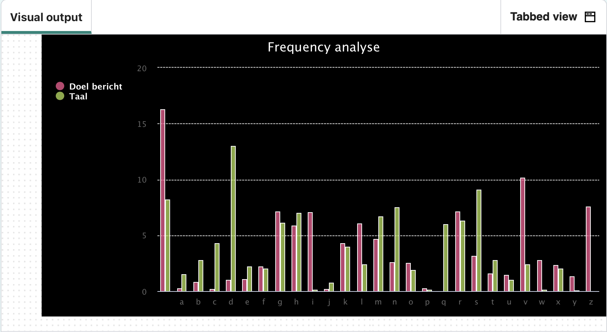

## Analyseer de frequentie

Gebruik een staafdiagram om de frequentie van letters in een gecodeerd bericht te analyseren. 

{:width="400px"}

In alle talen heeft elke letter in het alfabet een 'persoonlijkheid' of een reeks eigenschappen wanneer deze in die taal wordt gebruikt. Een van de meest voor de hand liggende kenmerken van een letter, in welke taal dan ook, is hoe vaak hij voorkomt. **Frequentieanalyse** is de methode om codes te ontcijferen door te kijken hoe vaak letters worden gebruikt in de taal van de code, en dat te vergelijken met hoe vaak gecodeerde letters in een bericht voorkomen. In het Engels is de letter **e** de meest gebruikte letter (deze verschijnt 12,8% van de tijd), gevolgd door **t** (met 9,1%). De minst gebruikte letter is **z**.

--- task ---

De coderegel `print(message_freq)` is niet langer nodig. Voeg een `#` toe aan het begin ervan, zodat Python dit negeert wanneer de code wordt uitgevoerd.

--- code ---
---
language: python filename: main.py - menu() line_numbers: true line_number_start: 72
line_highlights: 76
---

    elif choice == 'f':
        print('Analysing message…')
        message = get_text('input.txt')  # Take input from the same file. We have a 'longer.txt' or similar containing cyphertext we know to perform reasonably well for frequency analysis
        message_freq = frequency(message)  # Get the frequency of the letters in the message, as %
        # print(message_freq)
--- /code ---

--- /task ---

### Maak de frequentie grafiek functie

--- task ---

Zoek de `# Maak frequentie grafiek` opmerking en maak een nieuwe functie genaamd `maak_grafiek()`. Deze functie heeft twee parameters nodig, genaamd `tekst` en `taal`. Het frequentiediagram zal een **staaf** diagram zijn met de **titel** `Frequentie analyse` en met **x-as** labels met behulp van de **sleutels** uit de `freq` dictionary.

De `freq` dictionary waarden worden doorgegeven aan de functie wanneer deze later in de code wordt aangeroepen, via de `tekst` parameter.

--- code ---
---
language: python filename: main.py - make_chart() line_numbers: true line_number_start: 36
line_highlights: 37-38
---
# Make frequency chart
def make_chart(text, language): chart = Bar(width=800, height=400, title='Frequency analysis', x_labels = list(text.keys())) --- /code ---

--- /task ---

--- task ---

Label de grafiek met de **frequentie** van letters in het gecodeerde bericht en de letterfrequentie van de **taal** van het bericht. Deze gegevens zijn **aan** de **functie** doorgegeven via de `tekst` en `taal` parameters.

--- code ---
---
language: python filename: main.py - make_chart() line_numbers: true line_number_start: 36
line_highlights: 39-40
---
# Make frequency chart
def make_chart(text, language): chart = Bar(width=800, height=400, title='Frequency analysis', x_labels = list(text.keys())) chart.add('Target message', list(text.values()))  # Label the frequency data for the encoded message chart.add('Language', list(language.values()))  # Label the frequency data for the language --- /code ---

--- /task ---

--- task ---

**Geef** de grafiek zo weer dat deze wordt getoond wanneer de functie wordt aangeroepen.

--- code ---
---
language: python filename: main.py - make_chart() line_numbers: true line_number_start: 36
line_highlights: 42
---
# Make frequency chart
def make_chart(text, language): chart = Bar(width=800, height=400, title='Frequency analysis', x_labels = list(text.keys())) chart.add('Target message', list(text.values()))  # Label the frequency data for the encoded message chart.add('Language', list(language.values()))  # Label the frequency data for the language

    chart.render()
--- /code ---

--- /task ---

### Roep de frequentie grafiek functie aan

--- task ---

Vind je `elif` in de `menu()` functie. Voeg een regel code toe die het **Engelse** frequentiewoordenboek `importeert` uit het `frequency.py` bestand. Voeg nog een regel code toe die **** de functie `maak_grafiek` aanroept om het diagram te tekenen.

--- code ---
---
language: python filename: main.py - menu() line_numbers: true line_number_start: 75
line_highlights: 80-81
---

    elif choice == 'f':
        print('Analysing message…')
        message = get_text('input.txt')  # Take input from the same file. We have a 'longer.txt' or similar containing cyphertext we know to perform reasonably well for frequency analysis
        message_freq = frequency(message)  # Get the frequency of the letters in the message, as %
        # print(message_freq)
        lang_freq = english  # Import the English frequency dictionary
        make_chart(message_freq, lang_freq)  # Call the function to make a chart
--- /code ---

--- /task ---

--- task ---

**Test:** Voer je code uit om de frequentie analyse staafdiagram weer te geven.

**Foutopsporing:** je grafiek ziet er niet precies hetzelfde uit als de grafiek die wordt weergegeven in de afbeelding hierboven:
- Dat is normaal. Je grafiek toont de frequentie gegevens voor het geheime bericht dat je hebt ingevoerd in `input.txt`.

**Fouten opsporen:** Je ziet het volgende foutbericht `NameError: naam 'taal_freq' is not defined`:
- Controleer of je de regel code `taal_freq = english` hebt toegevoegd **voor** het aanroepen van de functie `maak_grafiek()`.

**Foutopsporing:** Je ziet een `indentation error` (inspring fout) bericht:
- Controleer of je al je nieuwe code correct hebt ingesprongen. Bekijk de bovenstaande taken nogmaals om dit te controleren.

--- /task ---

### Analyseer de frequentie grafiek

Het diagram dat is gemaakt toont de frequentie van letters in de Engelse taal, aangeduid als **Taal**. Je kunt zien dat de letter **e** de meest gebruikte letter in de Engelse taal is, omdat deze de hoogste balk heeft voor alle **taal** waarden.

In de frequentiekaart staat ook de frequentie van letters in je **gecodeerde** bericht, gelabeld als **doel bericht**. Hieronder vallen ook de spaties in je bericht, die te zien zijn in de laatste balk aan de rechterkant. Om uit te zoeken wat **codering** is gebruikt voor dit bericht, kun je de balken van het gecodeerde bericht vergelijken met de Engelse taal. De hoogste balk (waarbij je de spaties niet meerekent) in de gecodeerde berichttekst zal hoogstwaarschijnlijk een **e**zijn. De op één na hoogste letter zal hoogstwaarschijnlijk een **t** zijn, aangezien dit de volgende meest populaire letter is.

Codekrakers kunnen de frequentie van letters gebruiken om het type codering te achterhalen dat voor het bericht is gebruikt. Ze kunnen met vallen en opstaan **voorspellen** wat een letter zou kunnen vertegenwoordigen, waarbij ze het diagram als leidraad gebruiken.

--- task ---

Je geheime bericht is vrij klein, waardoor het lastig wordt om het te analyseren met behulp van een frequentiegrafiek. Wijzig je code zodat in plaats daarvan het bericht analyseert in `longer.txt`.

Wijzig `input.txt` in `longer.txt`.

--- code ---
---
language: python filename: main.py - menu() line_numbers: true line_number_start: 75
line_highlights: 77
---

    elif choice == 'f':
        print('Analysing message…')
        message = get_text('longer.txt') 
        message_freq = frequency(message)  # Get the frequency of the letters in the message, as %
--- /code ---

--- /task ---

--- task ---

**Analyseer** het frequentiediagram door te kijken naar de **Taal** waarden en de **Doel bericht** waarden. Merk op hoe de hoogste balk voor **taal** **e** en de hoogste balk voor **Doelbericht** **v** is. Dit komt omdat met de **Atbash** code, de letter **e** gecodeerd is met de letter **v**.

--- /task ---

--- save ---
