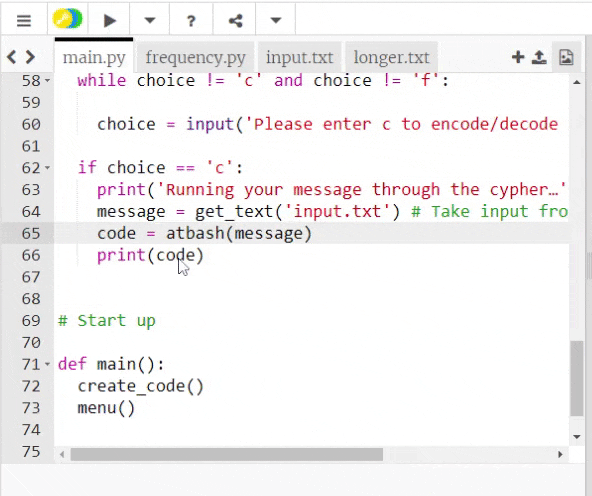
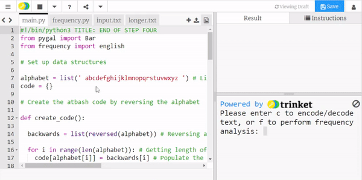

## Encode text from a file

It's time to encode a message from a text file.

{:width="400px"}

Loading the text from a file is more efficient than typing or pasting a large string into a program. There is less opportunity to 'break' your code when changing a single target file name, than when copy and pasting large blocks of text each time.

--- task ---

Find the `# Fetch and return text from a file` comment then define a `get_text()` function. This function has one parameter called `filename`. Use the `filename` to open the file and read it into the `text` variable, then **return** the `text` variable.

--- code ---
---
language: python filename: main.py - get_text() line_numbers: true line_number_start: 40
line_highlights: 41-45
---
# Fetch and return text from a file
def get_text(filename): with open(filename) as f: text = f.read().replace('\n','') # Need to strip the newline characters

  return text --- /code ---

--- /task ---

--- task ---

The `menu()` function needs to encode a secret message from a text file. **Replace** your secret message with the `get_text()` function call. Enter the name of the file `input.txt` as an **argument**.

--- code ---
---
language: python filename: main.py - menu() line_numbers: true line_number_start: 55
line_highlights: 57
---
  if choice == 'c': print('Running your message through the cypher…') message = get_text('input.txt') # Take input from a file code = atbash(message) print(code) --- /code ---

--- /task ---

You can now **add** your own secret message to the `input.txt` file.

--- task ---

Find the `input.txt` tab in Trinket to access the contents of the text file. You will see this just above your code window. Delete the `replace with your message` text and enter your own secret message.

--- /task ---

--- task ---

**Test:** Run your code to see if it displays your encoded message after entering the letter 'c' when prompted.

**Debug:** Your encoded message doesn't look exactly like the message in the screenshot:
- This is normal. This is the encoded message for the text `replace with your message`. Your message will be different.

**Debug:** You see an error message that says `TypeError: get_text() takes exactly 1 arguments`:
- Check that you have entered `input.txt` inside the round brackets on line 64

**Debug:** You see an `Indentation error` message:
- Check that you have correctly indented all of your new code. Revisit the tasks above to check.

--- /task ---

### Decode the message

The atbash cypher **encodes** a message using the reverse letters of the alphabet. This means that exactly the same code can be used to **decode** the message. You can test this by taking your encoded message, copying and pasting it into your `input.txt` file and running the code again.

--- task ---

**Run** your code so that it displays your encoded message. **Select** the encoded message and copy it. Go back to `input.txt` and delete your message. Next, **paste** your new message into the empty file.

Remember that your code converts any text to lower case, so you will see your message in lower-case letters.

--- collapse ---
---
title: Copying and pasting
---

You can copy text and paste a copy in another place.

 1. Select the text you want to copy by dragging your mouse over it while holding down the left button.
 2. Copy the text by using your browser's menu — choose **Edit** > **Copy**. You can also use a keyboard shortcut — <kbd>Ctrl</kbd>+<kbd>C</kbd> on Windows or Linux systems, or <kbd>Cmd</kbd>+<kbd>C</kbd> on a Mac.
 3. Move your text cursor (the flashing line that shows where you are typing) to where you want to place a copy of the text.
 4. Paste the text by using your browser's menu — choose **Edit** > **Paste**. You can also use a keyboard shortcut — <kbd>Ctrl</kbd>+<kbd>V</kbd> on Windows or Linux systems, or <kbd>Cmd</kbd>+<kbd>V</kbd> on a Mac.

--- /collapse ---

--- /task ---

--- task ---

**Test:** Run your code again and press 'c' when prompted. It will display the **decoded** version of your original message.

**Debug:** It still displays the encoded message:
- Make sure that you have copy and pasted the **encoded** message into `input.txt`

--- /task ---

In the next step you will write the code to **analyse the frequency** of letters in your text file.

--- save ---
